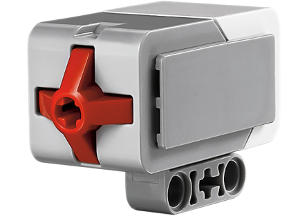

# Laboratorio 1 - Conociendo el Robot EV3 (LEGO)
# Fundamentos de Robótica Móvil
# Febrero 2024

# Integrantes:
- Johan López
- David Cocoma
- Joan Sebastián Jauregui
- Felipe Cruz

# Contenido
En el repositorio de este laboratorio se encuentra lo siguiente:
- README.md -> Archivo base con la descripción del laboratorio.
- Imgs -> Carpeta con imágenes utilizadas en el archivo README.

Tabla de Contenidos
---

- [1. Objetivos](#1-objetivos)
- [2. Herramientas necesarias](#2-herramientas-necesarias)
- [3. Procedimiento](#3-procedimiento)
  - [3.1 ¿Qué es un robot móvil?](#31-qué-es-un-robot-móvil-definir-qué-es-un-robot-y-cuáles-son-sus-principales-características)
  - [3.2 Presentación de los Robots](#32-presentación-de-los-robots-descripción-detallada-del-robot-ev3-incluyendo-sus-características-físicas-y-capacidades)
  - [3.3 Estado actual del robot y sistema de control](#33-estado-actual-del-robot-y-sistema-de-control)
  - [3.4 APIs y lenguajes de programación](#34-apis-y-lenguajes-de-programación-identificar-las-apis-o-librerías-disponibles-para-programar-los-robots-enumerar-los-lenguajes-de-programación-compatibles-con-los-robots)
  - [3.5 Herramientas de desarrollo propias](#35-herramientas-de-desarrollo-propias-demostración-de-las-herramientas-de-desarrollo-propias-de-los-robots-destacando-su-utilidad-y-funcionalidades-si-es-posible-resumir-las-herramientas-propias-que-disponen-los-robots-para-facilitar-la-programación-y-el-control)
  - [3.6 Sensores del robot](#36-sensores-del-robot-identificar-los-sensores-incorporados-en-los-robots-y-explicar-su-funcionamiento-que-compatibildiad-tienes-con-otros-sensores)
  - [3.7 Práctica de identificación y uso de los sensores integrados en los robots](#37-práctica-de-identificación-y-uso-de-los-sensores-integrados-en-los-robots-explicando-cómo-interactúan-con-el-entorno)
  - [3.8 Simulación del robot real](#38-modelado-del-robot-real-realizar-el-modelado-del-robot-ev3-en-coppeliasim)
  - [3.9 Programa simple de movimientos](#39-programa-simple-de-movimientos-utilizando-las-herramientas-propias-del-robot-crear-un-programa-sencillo-que-indique-movimientos-básicos-del-robot-como-desplazarse-hacia-adelante-girar-a-la-derecha-etc)
  - [3.10 Reflexión y Discusión](#310-reflexión-y-discusión-sesión-de-reflexión-donde-los-estudiantes-comparten-sus-experiencias-aprendizajes-y-posibles-mejoras-en-el-uso-del-robot-ev3-en-aplicaciones-prácticas)

## 1. Objetivos
1.1. Familiarizarse con el robots EV3, explorando sus características, herramientas de desarrollo, y sensores.
1.2. Modelar un robot móvil en software de simulación.
1.3. Crear un programa simple para controlar los movimientos del robot.

## 2. Herramientas Necesarias
Robot Lego Ev3.
Computador.

## 3. Procedimiento
### 3.1. ¿Qué es un robot móvil? Definir qué es un robot y cuáles son sus principales características.

  Un robot móvil, es un robot capaz de moverse bajo su propio control y puede ser una plataforma móvil con o sin manipuladores.
  
  Además, un robot es una entidad diseñada para realizar tareas útiles para humanos o equipos, excluyendo aplicaciones de automatización industrial. Los robots se caracterizan por su capacidad de ejecutar acciones de forma autónoma o semiautónoma, a menudo programados o dirigidos mediante inteligencia artificial. Algunos robots pueden ser fijos, mientras que los robots móviles son una subclase que se distingue por su movilidad, permitiéndoles desplazarse en diferentes entornos.
  
  Las principales características de un robot en general pueden incluir:
  
  1. **Autonomía:** Capacidad de operar sin intervención humana.
  2. **Sensorización:** Uso de sensores para percibir su entorno y ajustar sus acciones.
  3. **Capacidad de Manipulación (para algunos robots):** Uso de manipuladores o brazos robóticos para interactuar con el entorno.
  4. **Programabilidad:** Capacidad de ser programados para realizar distintas tareas.
  5. **Adaptabilidad:** Habilidad de ajustar su comportamiento en función de cambios en el entorno.
  
  Los robots pueden ser diseñados para aplicaciones específicas, como robótica industrial, robótica de servicio (que incluye a los robots móviles cuando son utilizados en logística o dispensación de alimentos), robótica médica, entre otras.

### 3.2. Presentación de los Robots: Descripción detallada del robot EV3, incluyendo sus características físicas y capacidades.
De acuerdo a las instrucciones de seguridad del EV3 este robot cumple con unas normas segun las cuales el dispositivo debe aceptar cualquier interferencia recibida ,ademas no puede causar ninguna interferencia dañina por si mismo ya que puede generar frecuencias de ondas de radio.Tambien enfatiza como medida de seguridad utilizar el cargador de LEGO incluido en el producto ya que es especial para el transformador LEGO y este a su vez para la bateria del EV3.

  El conjunto LEGO Mindstorms EV3 está compuesto por una variedad de partes mecánicas y eléctricas de las cuales se pueden ensamblar robots de diversas formas y propósitos.
  
  Un robot necesita tener sensores, que recolectan información de su entorno (los sentidos del robot), un procesador que analiza esta información, es decir, piensa (el cerebro del robot), partes mecánicas que se mueven y realizan una cierta actividad, así como una fuente de energía, que proporciona la energía para partes específicas del robot y le da vida.
  
  Las principales partes del robot son:
  
  - Unidad de control
  - Fuente de poder
  - Puertos
  - Motores servo
  - Sensores

  **Unidad de Control (Ladrillo EV3)**
  A primera vista, se hace evidente que la parte central del robot la ocupa la unidad cuadrada EV3 donde se encuentra el procesador. Está conectado a los sensores, de los cuales recibe y procesa información, a través de cables y puertos. Basándonos en los parámetros que establecemos en los programas que creamos, puede enviar señales de control a partes mecánicas, es decir, motores, y también puede emitir ciertas advertencias audibles. La comunicación entre la computadora y la unidad de control se establece a través de Bluetooth o un cable USB.
  De hecho, la operación del robot está controlada por dos microcontroladores AVR programables. Estos son dispositivos que, además del procesador, contienen algunos periféricos, como memoria, temporizadores, conversores A/D, por lo que se pueden programar varias veces.
  Por supuesto, esta integración se hace a expensas de la reducción de la memoria sobre el procesador estándar de la computadora, por lo que los programas tienen que ser eliminados con frecuencia para que el usuario pueda descargar otros nuevos.
  
  **Fuente de Poder**
  Como cualquier construcción electromecánica, el robot LEGO Mindstorms EV3 requiere energía. El suministro de energía estándar del robot LEGO está compuesto por 6 baterías AA de 1.5V. Los motores eléctricos son alimentados por 9V, y uno de los microcontroladores y algunos de los circuitos integrados son alimentados por 5V. El microcontrolador principal es alimentado por 3.3V. Los puertos de salida son alimentados por 4.3V y tienen protección contra sobrecorriente. Las versiones más nuevas del robot tienen baterías recargables como los teléfonos móviles. La energía puede obtenerse de células solares que el robot puede llevar, así como de la red eléctrica de la ciudad si el robot no se mueve.
  
  **Puertos**
  Ya hemos mencionado que la unidad de control recibe datos del entorno a través de sensores, los procesa y luego transmite señales de control correspondientes a los motores. La comunicación con dispositivos periféricos se realiza a través de puertos.
  Según la dirección de los datos, los puertos pueden dividirse en puertos de entrada y salida. Hay 4 puertos de cada uno.

  La unidad de salida está compuesta de motores, y la unidad de entrada está compuesta de sensores. A menos que el usuario cambie algo al escribir el programa, por defecto los puertos de salida se dividen y se utilizan de la siguiente manera:
  - puerto A para motores medianos
  - puerto B y C para dos grandes motores combinados
  - puerto D para un gran motor
  
  Además, a menos que el usuario defina lo contrario, por defecto los puertos de entrada se asignan de la siguiente manera:
  - puerto 1 para el sensor táctil
  - puerto 2 para el sensor de temperatura o el sensor giroscópico (giroscopio)
  - puerto 3 para el sensor de color (iluminación)
  - puerto 4 para la detección de luz infrarroja o sensor ultrasónico
  
  **Motores**
  Usualmente hay tres servomotores disponibles, estos motores reciben señales eléctricas a través de sus puertos, lo que les permite funcionar. Los servomotores se utilizan más comúnmente cuando se deben superar fuerzas pequeñas, como abrir puertas pequeñas, transportar cargas de pequeñas dimensiones a cortas distancias, y similares. Es por eso que se utilizan principalmente para hacer robots pequeños, brazos robóticos y otros manipuladores. Los servomotores no requieren una gran fuente de energía, son fáciles de controlar y son confiables.

  La base de un servomotor es en realidad un motor unidireccional con un cierto número de engranajes, y su funcionamiento se basa en el principio de modulación de ancho de pulso - PWM. El microcontrolador procesa los datos sobre el factor de relleno de la señal PWM (número de 0 a 100, y de 0 a -100), y basado en ese número se determina el porcentaje de duración de la señal PWM. Los números positivos se refieren a moverse hacia adelante y los negativos a moverse hacia atrás. Además de la obvia diferencia de tamaño, los motores varían en el número de RPM (rotaciones por minuto). El motor más grande es más lento pero proporciona más potencia. El motor mediano es más rápido y más estable. Contiene tacógrafos, que proporcionan información sobre el número de rotaciones y otros datos útiles.
  
  Con el diseño de construcción adecuado y la usabilidad del programa, puedes crear diferentes mecanismos de movimiento con los cuales el robot puede moverse usando ruedas y orugas; puede saltar como una rana, moverse como un escorpión, así como atrapar y empujar objetos, y colocarlos en lugares específicos.
### 3.3. Estado actual del robot y sistema de control.
  El robot cuenta con las siguientes piezas:
  - 7 Cables de red
  - 1 Sensor de ultrasonido
  - 2 Sensores de contacto
  - 1 Cable USB
  - 1 Motor extra
  - 1 sensor de giro
  - 1 sensor de colores
    
  Al robot le faltan las siguientes piezas:
  - Un cargador
    
### 3.4. APIs y lenguajes de programación: Identificar las APIs o librerías disponibles para programar los robots. Enumerar los lenguajes de programación compatibles con los robots.

  Para programar robots LEGO EV3, hay varias APIs y librerías disponibles que permiten utilizar una amplia gama de lenguajes de programación. Aquí tienes algunas de las opciones disponibles:

  a. **Python**: Puedes usar la imagen de MicroPython en una tarjeta SD y programar tu EV3 con Visual Studio Code. LEGO Education proporciona documentación completa y código API de muestra para comenzar(https://education.lego.com/en-us/downloads/mindstorms-ev3/software/). Además, está disponible ev3dev Python, un lenguaje de programación Python para controlar el robot EV3 (https://www.ev3dev.org/docs/programming-languages/).
  
  b. **Java**: Existe soporte para los sensores y actuadores de EV3 en Java, y puedes seguir las interfaces de LeJOS para la navegación local (https://www.ev3dev.org/docs/programming-languages/).
  
  c. **C, C++, y otros**: También existen librerías y enlaces para C, C++, C#, y otros lenguajes como Go, Prolog, Vala, Genie y Rust. Estos lenguajes son compatibles gracias a las distintas librerías y API que facilitan la integración con la plataforma EV3 (https://www.ev3dev.org/docs/programming-languages/).
  
  d. **LeJOS**: Es una alternativa de firmware y una API de Java para programar el EV3, que reemplaza el firmware estándar y añade funcionalidades para Java (https://en.wikipedia.org/wiki/Lego_Mindstorms_EV3).
  
  e. **ROBOTC**: Es un lenguaje de programación basado en C con un depurador de software integrado y soporta una gama de diferentes plataformas de hardware, incluyendo EV3 (https://en.wikipedia.org/wiki/Lego_Mindstorms_EV3).
  
  f. **MonoBrick**: Una librería de comunicación para C# que permite comunicarte con el ladrillo EV3 utilizando USB, Bluetooth o WiFi, y ofrece la posibilidad de comunicarse con el EV3 a través de Internet (https://intorobotics.com/additional-lego-ev3-resources-for-robotic-applications/).
  
  g. **Hardware virtual machine (HVM) para EV3**: Utilizando el lenguaje de programación Java, puedes crear una amplia gama de aplicaciones con el HVM desde Eclipse, con soporte para sistemas operativos Linux y Windows (https://intorobotics.com/additional-lego-ev3-resources-for-robotic-applications/).

Estos recursos te permitirán explorar y expandir las capacidades de programación de tus robots LEGO EV3 más allá de las opciones estándar proporcionadas por LEGO.

### 3.5. Herramientas de desarrollo propias: Demostración de las herramientas de desarrollo propias de los robots, destacando su utilidad y funcionalidades. (Si es posible). Resumir las herramientas propias que disponen los robots para facilitar la programación y el control.
El kit básico de LEGO Mindstorms EV3 incluye un conjunto de piezas LEGO Technic, motores, sensores y el brick EV3, que es el cerebro del robot. El brick EV3 está equipado con un procesador ARM9, puertos de entrada y salida para conectar sensores y motores, una pantalla LCD, botones de navegación y conectividad Bluetooth y USB.

  1. **Lego Mindstorms**
  Es una plataforma de robótica educativa que permite a los usuarios construir, programar y controlar robots utilizando bloques de construcción LEGO y un microcontrolador programable llamado EV3 (Eduardo), que es parte del kit de inicio Mindstorms EV3.
  Para controlar el EV3 y programar las acciones del robot, se utiliza este el software, que proporciona una interfaz gráfica de programación basada en bloques que permite crear secuencias de comandos arrastrando y soltando bloques de función en una pantalla.
  Además, también es posible programar el EV3 utilizando lenguajes de programación como LEGO Mindstorms EV3 MicroPython o incluso otros entornos de programación como Scratch o Python a través de herramientas de terceros.

Se puede programar el EV3 para realizar una variedad de acciones, como moverse, interactuar con su entorno utilizando sensores como los sensores de ultrasonidos, de color o de contacto, mostrar información en la pantalla LCD, emitir sonidos a través del altavoz integrado, e incluso conectarse y comunicarse con otros dispositivos a través de Bluetooth.

  1.1.  Interfaz
  

La interfaz del programa LEGO Mindstorms EV3 está organizada en diferentes categorías de bloques de acciones para programar el comportamiento del robot:

  1. **Motors (Motores)**: Bloques de acciones para controlar los motores conectados al EV3, permitiendo establecer velocidad, dirección y duración del movimiento.
  2. **Movement (Movimiento)**: Bloques específicos para controlar el movimiento del robot en distintas direcciones y distancias.
  3. **Display (Pantalla)**: Bloques para visualizar información en la pantalla LCD del EV3, incluyendo texto, imágenes y números.
  4. **Sound (Sonido)**: Bloques para reproducir sonidos a través del altavoz integrado en el EV3, agregando efectos de sonido o proporcionando retroalimentación auditiva.
  5. **Events (Eventos)**: Bloques para detectar y responder a eventos como presionar un botón o detectar un objeto con un sensor.
  6. **Control (Control)**: Bloques para controlar el flujo de ejecución del programa, incluyendo bucles, condiciones y otras  estructuras de control.
  7. **Sensors (Sensores)**: Bloques para leer datos de los sensores conectados al EV3, como sensores de ultrasonidos, de color o de  contacto.
  8. **Operators (Operadores)**: Bloques para realizar operaciones matemáticas y lógicas, como cálculos y comparaciones.
  9. **Variables (Variables)**: Bloques para trabajar con variables y almacenar datos en la memoria del EV3, permitiendo el uso de valores numéricos o de texto en diferentes partes del programa.
 

### 3.6. Sensores del robot Identificar los sensores incorporados en los robots y explicar su funcionamiento. Que compatibildiad tienes con otros sensores.
  
  **Sensores**
  
  El robot estándar de LEGO tiene cuatro tipos de sensores:
  - ultrasónico (el que parece ojos), que se utiliza para determinar la distancia entre el robot y un obstáculo,
  - óptico (sensor de color), que, como se implica por el nombre, reacciona al nivel de luz en su entorno, es decir, detecta el color como un valor del espectro electromagnético,
  - sensor de sonido, que reacciona al nivel de sonido en su entorno; sensor táctil, que, lo adivinaste, reacciona al tacto, es decir, al botón siendo presionado,
  - sensor giroscópico (giroscopio), mide el movimiento rotacional del objeto (robot) y los cambios en su orientación.

  **Sensor Ultrasónico**

  
  
  El sensor ultrasónico es un sensor digital que mide la distancia a un objeto. Además del receptor de ultrasonidos, que es una especie de micrófono especial, este sensor también tiene un transmisor de ultrasonidos. El transmisor envía una onda ultrasónica que rebota en el obstáculo y vuelve al robot. Esta onda que regresa es captada por el receptor, que es el sensor en sí. El robot calcula la distancia a un obstáculo midiendo el tiempo transcurrido desde que se emitió la onda ultrasónica hasta que el eco de esta onda, que ha rebotado en un objeto, regresa.
  
  La distancia puede medirse en pulgadas o centímetros. Cuando se utiliza la escala en centímetros, la distancia medible está entre 3 y 250 cm, con una precisión de +/- 1 cm. Cuando se utilizan pulgadas, la distancia medible está entre 1 y 99 pulgadas, con una precisión de +/- 0.394 pulgadas. La velocidad del ultrasonido es de unos 300 m/s, y la onda sonora viaja desde el transmisor hasta el obstáculo y de regreso, cruzando una distancia que es el doble de la distancia desde el robot al obstáculo. El procesador solo necesita usar la fórmula s=v*t para calcular la distancia al obstáculo.
  
  Para una medición más precisa, hay que tener en cuenta otros aspectos, como el hecho de que la velocidad del ultrasonido en el aire depende de la temperatura ambiente y de la frecuencia del ultrasonido emitido por el transmisor asociado con el sensor. No es difícil ver que esta característica nos recuerda a un murciélago que, aunque tiene un sentido de la vista escaso, se orienta de manera inconfundible en el espacio gracias a sus eco localizadores.
    
  **Sensor Óptico**
  
  
  
  El sensor óptico es un sensor digital que puede detectar el color o la intensidad de la luz que entra a través de la pequeña ventana en la cara del sensor. Lee a 1 kHz/segundo.
  
  Este sensor reacciona a la luz o cambios en la luz ambiental. Anteriormente, los sensores eran en blanco y negro y podían reconocer algunos tonos de gris. Hoy en día, los sensores son más complejos y pueden reconocer el color, es decir, el nivel en el espectro electromagnético. Esto es por lo que a menudo se les llama sensores de color. Los seres humanos (a diferencia de los animales) tienen un sentido de la vista desarrollado gracias a un cerebro altamente desarrollado, que es capaz de recibir y procesar una gran cantidad de información, lo que resulta en el reconocimiento de imágenes.
  
  El sensor se puede utilizar para:
  1. Lectura de colores: el robot reconoce siete colores (negro, azul, verde, amarillo, rojo, blanco, marrón y además sin color). Por ejemplo, el robot puede ser programado para clasificar bloques de colores, decir los nombres de los colores que reconoce, o detener la acción cuando reconoce rojo.
  2. Reflexión de luz: el robot usa una lámpara para emitir luz roja y mide la intensidad de la luz reflejada por el objeto. Usa una escala de 0 (muy oscuro) a 100 (muy claro). Por ejemplo, el robot puede ser programado para moverse alrededor de una superficie blanca hasta que encuentra una superficie negra.
  3. Luz ambiental (entorno): el robot mide la fuerza de la luz recibida del entorno, por ejemplo, la luz que viene de una lámpara. Usa la misma escala que en la segunda opción. Por ejemplo, el robot puede ser programado para activar una alarma de despertador cuando sale el sol.
  
  Hay claras limitaciones cuando se trata de sensores, es decir, robots; por lo tanto, orientarse en el espacio basado en imágenes en forma de un gran número de puntos es difícil. Es por eso que este sensor, y la comunicación a través de él, es un gran desafío para los constructores.
  
  **Sensor táctil**
  
  
  
  Este es en realidad un interruptor, que tiene dos estados:
  - presionado (cuando el robot toca un obstáculo) o
  - liberado (cuando el sensor no está tocando ningún objeto).
  
  **Giroscopio**
  
  
  
  El giroscopio es un sensor digital que detecta el movimiento y los cambios en el movimiento del robot. Cuando el robot se mueve, este sensor lo presentará como el cambio en la velocidad de rotación en grados por segundo (deg/s). La tasa máxima es de 440 deg/s.
  
  Con base en estos datos, el usuario puede determinar si el robot está girando y también programar estos giros (con una precisión de +/- 3 grados para un giro de 90 grados). Para que el sensor produzca resultados precisos, es necesario mantener el robot inmóvil antes de encenderlo, para que el sensor pueda calibrarse correctamente.
  
  Además de los mencionados anteriormente, hay otros tipos de sensores disponibles, como el sensor de sonido, sensor de temperatura, sensor infrarrojo, etc.

### 3.7. Práctica de identificación y uso de los sensores integrados en los robots, explicando cómo interactúan con el entorno.

Los sensores del LEGO Mindstorms EV3 interactúan con su entorno mediante la detección de cambios físicos o ambientales y convirtiéndolos en señales electrónicas que el ladrillo inteligente EV3 puede procesar. Cada tipo de sensor opera basándose en principios específicos:

1. **Sensor de tacto**: Este sensor funciona de manera similar a un botón. Cuando se aplica presión sobre su extremo, cierra un circuito eléctrico, enviando una señal al ladrillo EV3 que indica que ha sido presionado. Esto permite al robot reaccionar a colisiones o a ser manipulado manualmente.

2. **Sensor de color**: Utiliza un LED para emitir luz sobre un objeto y luego mide la luz reflejada con un fotodetector. Dependiendo de la cantidad y el tipo de luz reflejada, el sensor puede determinar el color del objeto o la intensidad de la luz ambiental. Este principio permite al robot seguir líneas en el suelo o clasificar objetos por color.

3. **Sensor de distancia por infrarrojos**: Emite ondas de luz infrarroja desde un LED y detecta la luz reflejada por objetos cercanos con un fotodetector. La distancia al objeto se calcula en función del tiempo que tarda la luz en regresar al sensor o por la intensidad de la luz reflejada. Este sensor puede usarse para evitar obstáculos, medir distancias o interactuar con un control remoto infrarrojo.

4. **Sensor giratorio (o de rotación)**: Integrado en los motores, este sensor mide la cantidad de rotación del eje del motor, permitiendo al ladrillo inteligente calcular cuánto se ha movido o girado el robot. Esto se logra mediante encoders rotativos que cuentan los giros del eje para proporcionar una medición precisa del movimiento.

Cada uno de estos sensores permite al robot EV3 percibir su entorno de manera diferente, lo que facilita la realización de tareas complejas como navegar laberintos, seguir líneas, sortear obstáculos, y reaccionar a inputs humanos. La programación del ladrillo inteligente EV3 permite definir cómo reacciona el robot ante las señales recibidas de los sensores, lo que posibilita la creación de comportamientos robotizados sofisticados y adaptativos.

### 3.8. Simulación del robot real: Realizar el modelado y simulación del robot EV3, en CoppeliaSim.

En el siguiente enlace se encuentra un video (realizado por uno de los miembros del equipo) donde se explica y demuestra cómo importar el modelo del robot EV3 dentro de CoppeliaSim, para posteriormente utilizar una toolbox de Matlab para realizar simulaciones con el robot EV3:

https://youtu.be/8RXiWQjAwGA

### 3.9. Programa simple de movimientos: Utilizando las herramientas propias del robot, crear un programa sencillo que indique movimientos básicos del robot, como desplazarse hacia adelante, girar a la derecha, etc.
### 3.10 Reflexión y Discusión: Sesión de reflexión donde los estudiantes comparten sus experiencias, aprendizajes y posibles mejoras en el uso del robot EV3 en aplicaciones prácticas.
