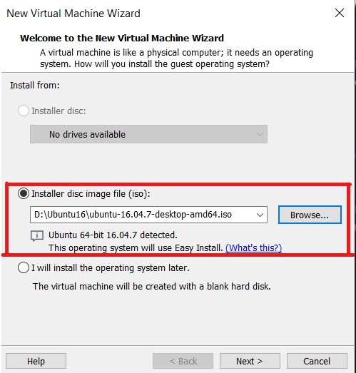

# Laboratorio 2 A - Introducción a ROS
# Fundamentos de Robótica Móvil
# Marzo 2024

# Integrantes:
- Johan López
- David Cocoma
- Joan Sebastián Jauregui
- Felipe Cruz

# Contenido
En el repositorio de este laboratorio se encuentra lo siguiente:
- README.md -> Archivo base con la descripción del laboratorio.
- Imgs -> Carpeta con imágenes utilizadas en el archivo README.

# Proceso
Esta práctica se realizó en un computador Windows 10.

## 1. Instalar Máquina Virtual
Instalar el software VMWare Workstation Player versión 17. El software es gratuito para uso no comercial y se puede descargar de manera gratuita en el siguiente link:

https://www.vmware.com/products/workstation-player.html

## 2. Descargar Ubuntu 16.04
Descargar el archivo .iso para instalar Ubuntu 16.04. Este archivo se consigue de manera gratuita en el siguiente link, bajo el nombre de *Desktop Image*:

https://releases.ubuntu.com/16.04/

## 3. Crear máquina virtual con Ubuntu 16.04
Abrir el software VMWare Player instalado en el paso anterior y crear una nueva máquina virtual.

Utilizar la opción de instalación *Installer disc image file (.iso)*. En *Browse...* se puede navegar por los archivos del computador para seleccionar el archivo .iso descargado anteriormente.

Rellenar la información con el nombre de usuario y contraseñas que se deseen. La contraseña colocada es la que se usa para iniciar sesión dentro de la máquina virtual.

Colocar nombre a la máquina virtual (el que se desee) y la ubicación dónde se quiere guardar la información de la máquina virtual. Se recomienda utilizar una ubicación que tenga suficiente espacio de almacenamiento.

Configurar el almacenamiento de la información de la máquina virtual siguiendo las recomendaciones de la vevntana emergente.

Revisar la instalación. Antes de continuar, hacer click en *Customize Hardware...* para incrementar la RAM de la máquina virtual y que ésta tenga un meyor rendimiento (opcional).

Si se desea un mayor rendimiento para la máquina virtual, se pueden realizar diferentes configuraciones. Se recomienda seguir las recomendaciones de la ventana emergente.

## 4. Iniciar la máquina virtual
En la interfaz inicial de VMWare, se selecciona la máquina virtual que se configuró con Ubuntu 16.04 y le damos a *Play*.

La primera vez que se inicia la máquina virtual, se debe esperar a que se realice la instalación de Ubuntu.

Al iniciarse la máquina virtual, ingresar con el usuario y contraseña creados anteriormente. Una vez la máquina virtual esté lista se debería ver de la siguiente manera:

## 5. Instalar ROS en la máquina virtual
Seguir las instrucciones para instalar ROS Noetic en Ubuntu 16.04, las cuales se encuentran en el siguiente link:

https://www.youtube.com/watch?v=Vq5fvsd896M

## 6. Verificar instalación de ROS
Para verificar si la instalación de ROS se realizó correctamente se debe hacer lo siguiente dentro de la máquina virtual:

Abrir una terminal y ejecutar los siguientes comandos:

´´´
sudo su
roscore
´´´

Si la instalación fue correcta, se obtiene lo siguiente en la terminal:

