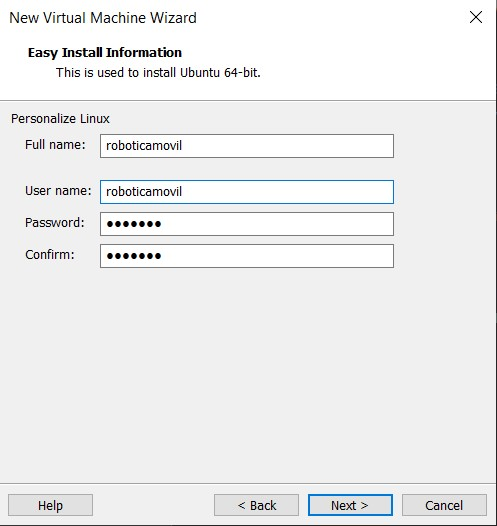

# Laboratorio 2 A - Introducción a ROS
# Fundamentos de Robótica Móvil
# Abril 2024


# Integrantes:
- Johan López
- David Cocoma
- Joan Sebastián Jauregui
- Felipe Cruz

# Contenido
En el repositorio de este laboratorio se encuentra lo siguiente:
- README.md -> Archivo base con la descripción del laboratorio.
- Imgs -> Carpeta con imágenes utilizadas en el archivo README.

# Instalar ROS en máquina virtual
Esta práctica se realizó en un computador Windows 10. Utilizando una máquina virtual con Ubuntu 16.04.

## 1. Instalar Máquina Virtual
Instalar el software VMWare Workstation Player versión 17. El software es gratuito para uso no comercial y se puede descargar de manera gratuita en el siguiente link:

https://www.vmware.com/products/workstation-player.html

## 2. Descargar Ubuntu 16.04
Descargar el archivo .iso para instalar Ubuntu 16.04. Este archivo se consigue de manera gratuita en el siguiente link, bajo el nombre de *Desktop Image*:

https://releases.ubuntu.com/16.04/

## 3. Crear máquina virtual con Ubuntu 16.04
Abrir el software VMWare Player instalado en el paso anterior y crear una nueva máquina virtual.


Utilizar la opción de instalación *Installer disc image file (.iso)*. En *Browse...* se puede navegar por los archivos del computador para seleccionar el archivo .iso descargado anteriormente.


Rellenar la información con el nombre de usuario y contraseñas que se deseen. La contraseña colocada es la que se usa para iniciar sesión dentro de la máquina virtual.



Colocar nombre a la máquina virtual (el que se desee) y la ubicación dónde se quiere guardar la información de la máquina virtual. Se recomienda utilizar una ubicación que tenga suficiente espacio de almacenamiento.


Configurar el almacenamiento de la información de la máquina virtual siguiendo las recomendaciones de la vevntana emergente.


Revisar la instalación. Antes de continuar, hacer click en *Customize Hardware...* para incrementar la RAM de la máquina virtual y que ésta tenga un meyor rendimiento (opcional).


Si se desea un mayor rendimiento para la máquina virtual, se pueden realizar diferentes configuraciones. Se recomienda seguir las recomendaciones de la ventana emergente.


## 4. Iniciar la máquina virtual
En la interfaz inicial de VMWare, se selecciona la máquina virtual que se configuró con Ubuntu 16.04 y le damos a *Play*.


La primera vez que se inicia la máquina virtual, se debe esperar a que se realice la instalación de Ubuntu.

Al iniciarse la máquina virtual, ingresar con el usuario y contraseña creados anteriormente. Una vez la máquina virtual esté lista se debería ver de la siguiente manera:


## 5. Instalar ROS en la máquina virtual
Seguir las instrucciones para instalar ROS Noetic en Ubuntu 16.04, las cuales se encuentran en el siguiente link:

https://www.youtube.com/watch?v=Vq5fvsd896M

## 6. Verificar instalación de ROS
Para verificar si la instalación de ROS se realizó correctamente se debe hacer lo siguiente dentro de la máquina virtual:

Abrir una terminal y ejecutar los siguientes comandos:

```
sudo su
roscore
```

Si la instalación fue correcta, se obtiene lo siguiente en la terminal:


# ¿Qué es ROS?

## ROS (Robot Operating System)

ROS es un conjunto de herramientas y bibliotecas de software de código abierto para el desarrollo de aplicaciones robóticas. Aunque no es un sistema operativo en sí mismo, proporciona un marco de trabajo flexible que se ejecuta sobre Linux.

## Ventajas de ROS:

- **Arquitectura modular**: Permite dividir el desarrollo del robot en nodos independientes que se comunican eficientemente entre sí.
- **Comunidad activa**: Gran comunidad de usuarios y desarrolladores que contribuyen con paquetes, tutoriales y soporte técnico.
- **Reutilización de código**: Ofrece una amplia gama de paquetes y bibliotecas preexistentes para funciones robóticas comunes.
- **Herramientas de desarrollo**: Proporciona herramientas para visualización, simulación, depuración y análisis, facilitando el desarrollo de aplicaciones robóticas.
- **Flexibilidad y escalabilidad**: Adaptable a una variedad de plataformas y configuraciones de hardware, desde robots simples hasta sistemas complejos.
- **Interoperabilidad**: Compatible con varios lenguajes de programación y sistemas de middleware, permitiendo la integración de diferentes componentes de software y hardware.

# Comandos ROS
https://w3.cs.jmu.edu/spragunr/CS354_F17/handouts/ROSCheatsheet.pdf

## rosnode
- *rosnode cleanup*: Elimina nodos que han sido desconectados del grafo de comunicación.
- *rosnode info*: Proporciona información detallada sobre un nodo específico.
- *rosnode kill*: Detiene un nodo en ejecución.
- *rosnode list*: Lista todos los nodos actualmente en ejecución.
- *rosnode machine*: Muestra todos los nodos que se ejecutan en una máquina específica.
- *rosnode ping*: Verifica si un nodo está en línea y responde a los mensajes.

## rostopic
- *rostopic bw*: Muestra el ancho de banda utilizado por un tópico.
- *rostopic echo*: Muestra los mensajes que se publican en un tópico.
- *rostopic find*: Encuentra tópicos por su nombre.
- *rostopic hz*: Muestra la frecuencia de publicación de un tópico.
- *rostopic info*: Proporciona información detallada sobre un tópico específico.
- *rostopic list*: Lista todos los tópicos actualmente en uso.
- *rostopic pub*: Publica datos en un tópico.
- *rostopic type*: Muestra el tipo de mensajes que se publican en un tópico.

## rosservice
- *rosservice args*: Muestra los argumentos de un servicio.
- *rosservice call*: Llama a un servicio con argumentos específicos.
- *rosservice find*: Encuentra servicios por su nombre.
- *rosservice info*: Proporciona información detallada sobre un servicio específico.
- *rosservice list*: Lista todos los servicios disponibles.
- *rosservice type*: Muestra el tipo de datos que se espera que un servicio utilice.
- *rosservice uri*: Muestra la URI (Identificador de Recursos Uniforme) de un servicio.

## rosmsg
- *rosmsg list*: Lista todos los tipos de mensajes disponibles.
- *rosmsg md5*: Muestra el MD5 sum de un tipo de mensaje.
- *rosmsg package*: Muestra todos los tipos de mensajes en un paquete específico.
- *rosmsg packages*: Lista todos los paquetes que contienen tipos de mensajes.
- *rosmsg show*: Muestra la definición de un tipo de mensaje.

## rospack
- *rospack find*: Encuentra la ubicación de un paquete.
- *rospack list*: Lista todos los paquetes disponibles.
- *rospack info*: Proporciona información detallada sobre un paquete específico.

# Descripción del programa PYPUVEL.PY
- *Paso 1. Importar módulos necesarios:*  Se importa `rospy` y el tipo de mensaje `Twist` de `geometry_msgs.msg`, que se utiliza para enviar comandos de velocidad. También se importa `random` para generar números aleatorios.
- *Paso 2. Inicialización del nodo:*  
   - `rospy.init_node('pypubvel', anonymous=False)` Esta línea inicializa un nuevo nodo llamado 'pypubvel' en ROS. El argumento `anonymous=False` indica que el nombre del nodo no necesita ser único, permitiendo que múltiples instancias del mismo nodo tengan el mismo nombre.

- *Paso 3. Creación de un publicado:* `pub = rospy.Publisher('turtle1/cmd_vel', Twist, queue_size=1000)`: Esta línea crea un objeto publicador para enviar mensajes de tipo `Twist` al tópico `turtle1/cmd_vel`. El `queue_size=1000` define el tamaño de la cola de mensajes en espera para ser enviados.
- *Paso 4. Establecimiento de la frecuencia de publicación:* `rate = rospy.Rate(2)`: Define la frecuencia con la que se enviarán los mensajes. En este caso, se enviarán dos mensajes por segundo.
- *Paso 5. Bucle principal:*
     - `while not rospy.is_shutdown()`: Este bucle se ejecuta mientras el nodo de ROS esté activo y no se haya solicitado su cierre.
   - Dentro del bucle:
     - Se crea un nuevo mensaje de tipo `Twist`.
     - `msg.linear.x = random()`: Asigna un valor aleatorio entre 0 y 1 a la velocidad lineal en el eje x del mensaje.
     - `msg.angular.z = 2*random() - 1`: Asigna un valor aleatorio entre -1 y 1 a la velocidad angular en el eje z.
     - `rospy.loginfo(...)`: Registra información sobre el mensaje de velocidad que se va a enviar. Es útil para depuración y seguimiento del comportamiento del nodo.
     - `pub.publish(msg)`: Publica el mensaje en el tópico `turtle1/cmd_vel`.
     - `rate.sleep()`: Espera lo suficiente para mantener la tasa de publicación deseada (2 Hz en este caso).
# Descripción del programa PYSUBPOSE.PY
- *Paso 1. Importar módulos necesarios:*
  - `import rospy`: Importa la biblioteca rospy que permite usar Python para interactuar con ROS.
  - `from turtlesim.msg import Pose`: Importa el tipo de mensaje `Pose` del paquete `turtlesim`, que se utiliza para representar la posición y orientación de una tortuga en el simulador.
- *Paso 2. Definición de la función que maneja los mensajes:*
   - `def poseMessageReceived(message)`: Define una función que será llamada cada vez que se reciba un mensaje del tipo `Pose`.
   - Dentro de la función `rospy.loginfo(...)`: Registra la posición (x, y) y la orientación (`theta`) de la tortuga cada vez que se recibe un mensaje. Esta función es esencial para visualizar en el log de ROS la información recibida.
- *Paso 3. Inicialización del nodo:* `rospy.init_node('pysubpose', anonymous=False)`: Esta línea inicializa un nuevo nodo llamado 'pysubpose'. El argumento `anonymous=False` indica que el nombre del nodo no necesita ser único.
- *Paso 4. Creación de un suscriptor:* `sub = rospy.Subscriber('turtle1/pose', Pose, poseMessageReceived)`: Crea un objeto suscriptor que escucha en el tópico `turtle1/pose` y utiliza la función `poseMessageReceived` para manejar los mensajes recibidos. Cada vez que un mensaje `Pose` es publicado en ese tópico, la función `poseMessageReceived` es llamada con el mensaje como argumento.
- *Paso 5. Bucle de espera de eventos (spin):* `rospy.spin()`: Un bucle que mantiene el script ejecutándose y esperando por nuevos mensajes. A diferencia de otros bucles que manejan la frecuencia de ejecución manualmente, `rospy.spin()` simplemente bloquea y espera por eventos hasta que el nodo se apaga. Este método es útil cuando un nodo está dedicado principalmente a escuchar y procesar mensajes entrantes.

# Obteniendo dimensiones del plano con turtle_teleop_key y PYSUBPOSE.PY
