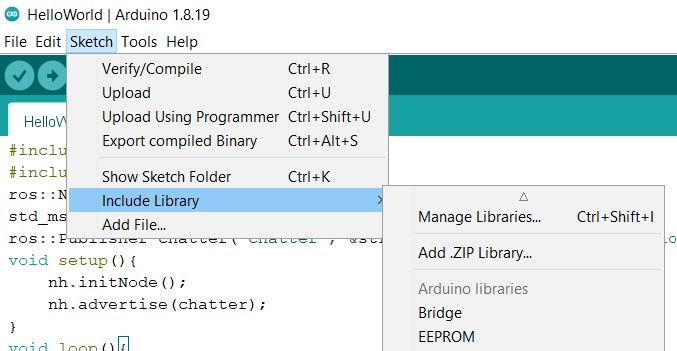
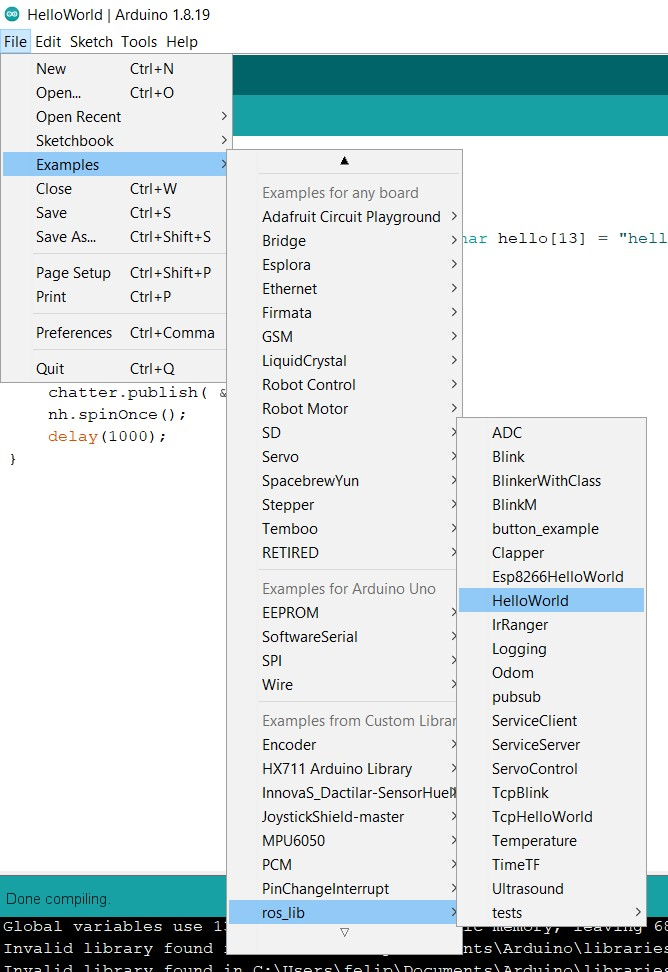
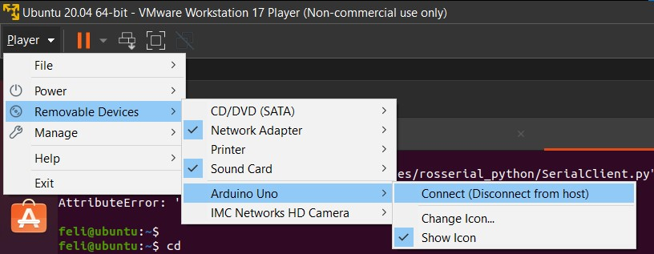
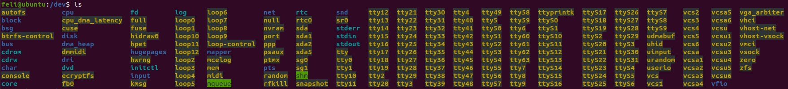
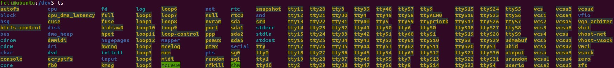
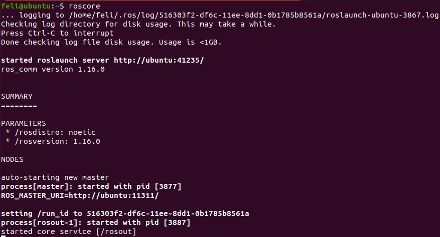
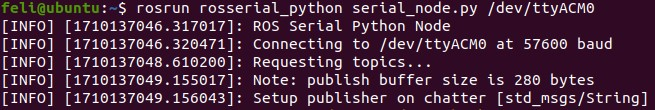
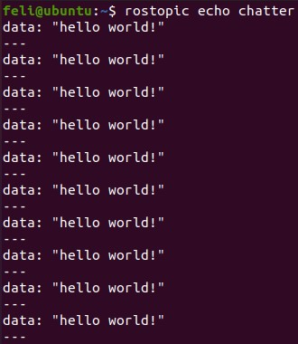

# Laboratorio 2 B - ROS y EV3
# Fundamentos de Robótica Móvil
# Marzo 2024


# Integrantes:
- Johan López
- David Cocoma
- Joan Sebastián Jauregui
- Felipe Cruz

# Contenido
En el repositorio de este laboratorio se encuentra lo siguiente:
- README.md -> Archivo base con la descripción del laboratorio.
- Imgs -> Carpeta con imágenes utilizadas en el archivo README.
- Arduino -> Carpeta con códigos y librerías de Arduino utilizadas.

Para esta práctica se tiene un computador Windows 10 con una máquina virtual VMWare Workstation Player V17 Linux Ubuntu versión 20.04. En el Windows 10 se instaló el IDE de Arduino y en la máquina virtual Linux se instaló ROS Noetic (junto con *catkin* -> http://wiki.ros.org/catkin).

## Conexión Arduino --- ROS

Se conectará Arduino con ROS a través del paquete *rosserial*. Para esto, se siguen algunos de los ejemplos de la documentación oficial de *rosserial*, los cuales se encuentran en el siguiente link:

http://wiki.ros.org/rosserial_arduino/Tutorials

### Configuración del proyecto

Abrir una terminal dentro de la máquina virtual Linux Ubuntu y ejecutar lo siguiente:

```
sudo apt-get install ros-noetic-rosserial-arduino
sudo apt-get install ros-noetic-rosserial
```

En la terminal de la máquina virtual Linux, navegamos usando el comando *cd* hasta ubicarnos dónde queremos guardar la carpeta del proyecto que condendrá todos los programas, configuraciones y demás archivos necesarios para la conexión. Una vez ubicados en dónde se desee guardar esta carpeta, ejecutamos los siguientes comandos (la carpeta se llamará *ArduinoROS*):

```
mkdir ArduinoROS
cd ArduinoROS
mkdir src
catkin_make -DPYTHON_EXECUTABLE=/usr/bin/python3
source devel/setup.bash
```

Para verificar si todo funcionó correctamente, ejecutar el comando *ls* en la terminal y revisar que aparezcan 3 carpetas: *build*, *devel* y *src*.

Instalar *rosserial* dentro del proyecto Catkin que se ha creado anteriormente. Para esto, ejecutar los siguientes comandos en la terminal (si se uso *cd* para navegar por la terminal, regresar a la ubicación de la carpeta *ArduinoROS*):

```
cd src
git clone https://github.com/ros-drivers/rosserial.git
cd ..
catkin_make
catkin_make install
```

Para verificar si todo funcionó correctamente, ejecutar el comando *ls* en la terminal y revisar que aparezcan 4 carpetas: *build*, *devel*, *install* y *src*. Además, dentro de la carpeta *src* debe haber una nueva carpeta llamada *rosserial*.

Descargar el archivo *ros_lib.zip*, el cual se encuentra disponible en este repositorio en la ruta *Lab2b/Arduino/ros_lib.zip*.

Abrir el IDE de Arduino e instalar la librería *ros_lib*. Para esto, ir a *Sketch -> Include Library -> Add .ZIP Library*, tal como se muestra en la imagen:



Seleccionar el archivo *ros_lib.zip* que se descargó previamente. Para verificar que se realizó la instalación de manera correcta, ir a *File -> Examples*, y buscar *ros_lib* tal como se muestra en la imagen:



### Probando la conexión

Conectar un Arduino UNO al puerto USB del computador.

En nuestro caso, primero intentamos conectar el Arduino a la máquina virtual y probar la conexión pero no funcionó la compilación del código Arduino. El error se encuentra en la siguiente imagen:


Lo que hicimos, entonces, fue conectar el Arduino UNO al host (computador Windows) para compilar el código y subirlo, y luego conectar el Arduino a la máquina virtual para probar la conexión con ROS (con el código ya ejecutandose en el Arduino). Para cambiar el Arduino del host a la máquina virtual, VMWare tiene una opción que permite hacer el cambio con un click, tal como se muestra en la siguiente imagen:



Abrir el IDE de Arduino y copiar el siguiente código, el cual se encuentra como el ejemplo *HelloWorld* de la librería *ros_lib*:

```
#include <ros.h>
#include <std_msgs/String.h>
ros::NodeHandle nh; 
std_msgs::String str_msg;
ros::Publisher chatter("chatter", &str_msg);
char hello[13] = "hello world!";
void setup(){
    nh.initNode();
    nh.advertise(chatter);
}
void loop(){
    str_msg.data = hello;
    chatter.publish( &str_msg );
    nh.spinOnce();
    delay(1000);
}
```

Conectar el Arduino UNO al host (computador Windows) y subir el código al Arduino UNO. Para esto, utilizar las funcionalidades de la IDE de Arduino.

Detectar cuál es el nombre del puerto serial donde se encuentra conectado el Arduino dentro de la máquina virtual. Para ello, con una terminal abierta, realizar lo siguiente:

1. Ejecutar comando `cd /dev`
2. Ejecutar comando `ls`
3. Conectar el Arduino UNO a la máquina virtual
4. Ejecutar el comando `ls`
5. Revisar las diferencias entre los resultados del paso 2 y 4.

Lo obtenido del paso 2 y 4 varía de computador en computador. Como ejemplo, se muestra lo que se obtuvo para explicar qué debe buscarse dentro de la información. 

La siguiente imagen, muestra lo que se obtuvo en el paso 2:



La siguiente imagen, muestra lo que se obtuvo en el paso 4:



Resulta tedioso hacer esta revisión, pero es importante detectar dónde se conectó el Arduino dentro de la máquina virtual. Al comparar ambos resultados, podemos observar que al conectar el Arduino aparecen dos nuevos items en el listado: *serial* y *ttyACM0*. El que nos interesa es el que comienza con *tty*, en este caso **ttyACM0**.

Abrir 3 ventanas de la terminal.

Ejecutar el siguiente comando en la primera ventana de la terminal:

```
roscore
```

Se verá lo siguiente en la terminal:



Ejecutar el siguiente comando en la segunda ventana de la terminal:

```
rosrun rosserial_python serial_node.py /dev/ttyACM0
```

Acá se debe colocar el *tty* correspondiente al Arduino conectado (este es el nombre que detectamos anteriormente al revisar con *ls* la carpeta *dev* al conectar el Arduino a la máquina virtual).

Se verá lo siguiente en la terminal:



Ejecutar el siguiente comando en la tercera ventana de la terminal:

```
rostopic echo chatter
```

Si todo está funcionando correctamente, se verá lo siguiente en la terminal:



Con esto terminamos de probar la conexión, y para terminar la ejecución de las ventanas de la terminal, presionar *Ctrl + C* dentro de cada ventana.
