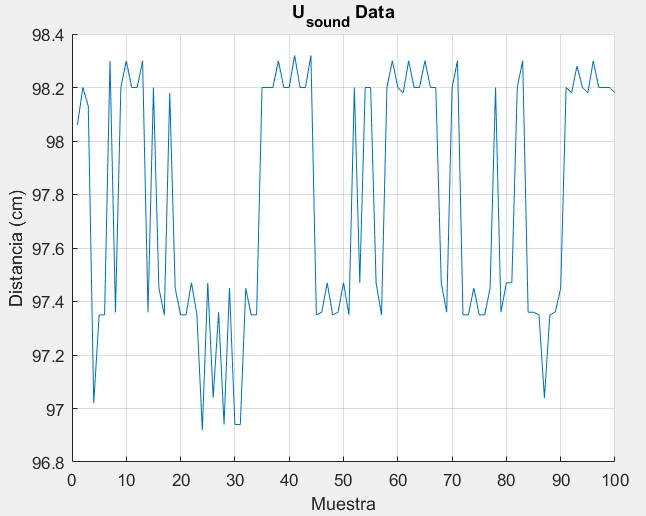
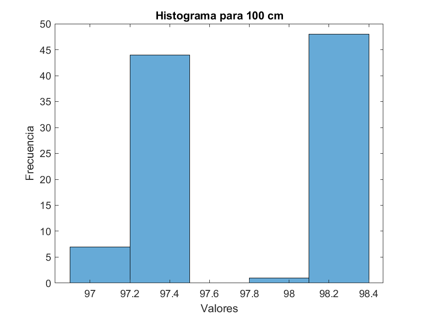
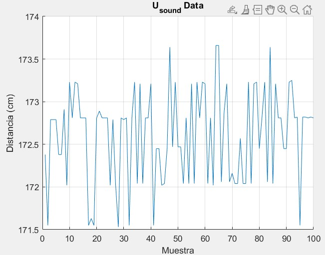
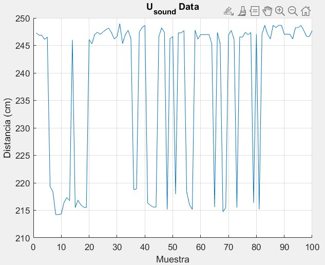
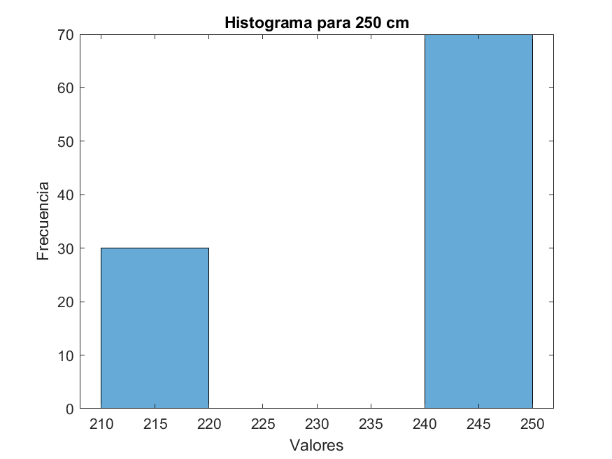

# Laboratorio 3 - Incertidumbre en sensores
# Fundamentos de Robótica Móvil
# Mayo 2024


# Integrantes:
- Johan López
- David Cocoma
- Joan Sebastián Jauregui
- Felipe Cruz

# Contenido
En el repositorio de este laboratorio se encuentra lo siguiente:
- README.md -> Archivo base con la descripción del laboratorio.
- Imgs -> Carpeta con imágenes utilizadas en el archivo README.
- Code -> Carpeta con los diferentes códigos utilizados durante la práctica: Matlab (*.m*), Arduino (*.ino*), y LegoMindstorms (*.lmsp*).
- Datos -> Carpeta con los archivos .csv que contienen los datos tomados y códigos en Python para el procesamiento de estos.

Tabla de Contenidos
---

- [Cuestionario](#cuestionario)
- [Sensor Lidar](#sensor-lidar)
   - [Preparación Lidar](#preparación-del-entorno-y-del-sensor-lidar)
   - [Toma de datos Lidar](#toma-de-datos-lidar)
   - [Procesamiento de datos Lidar](#procesamiento-de-datos-lidar)
      - [Ploteo](#ploteo)
      - [Mapa de ocupación](#mapa-de-ocupación)
      - [Mapa del entorno](#mapa-del-entorno)
   - [Análisis y fuentes de error](#análisis-y-fuentes-de-error)
- [Sensor Ultrasonido](#sensor-ultrasonido)
   - [Preparación Ultrasonido](#preparación-del-entorno-y-del-sensor-ultrasonido)
   - [Toma de datos ultrasonido](#toma-de-datos-ultrasonido)
   - [Procesamiento de datos ultrasonido](#procesamiento-de-datos-ultrasonido)
      - [Medidas estadísticas](#medidas-estadísticas)
      - [Gráficos estadísticos](#gráficos-estadísticos)
      - [Análisis y conclusiones](#análisis-y-conclusiones)
- [Sensores Lego](#sensores-lego)
   - [Preparación Robot Lego EV3](#preparación-del-entorno-y-del-robot-lego-ev3)
   - [Medición distancia](#medición-de-distancia-en-avance)
      - [Experimento de avance](#experimento-de-avance)
         - [Avance ultrasonido](#avance-con-ultrasonido)
         - [Avance encoder](#avance-con-encoder-del-motor)
      - [Experimento de avance a máxima velocidad](#experimento-de-avance-a-máxima-velocidad)
         - [Avance ultrasonido máxima velocidad](#avance-con-ultrasonido-máxima-velocidad)
         - [Avance encoder máxima velocidad](#avance-con-encoder-del-motor-máxima-velocidad)
      - [Análisis/Errores avance](#análisis-comparativo-y-cálculo-de-errores-avance)
   - [Medición ángulo de giro](#medición-del-ángulo-de-giro-de-las-ruedas)
      - [Setup experimental](#setup-experimental)
      - [Experimento 30 grados](#experimento-30-grados)
      - [Experimento 45 grados](#experimento-45-grados)
      - [Análisis/Errores giro](#análisis-comparativo-y-cálculo-de-errores-giro)

# Cuestionario
1. ¿Qué es el Vocabulario Internacional de Metrología (VIM)? 

 Es un diccionario terminolohgico que contiene las definiciones y denominaciones que conciernen a la metrologia,ciencia de las mediciones y sus aplicaciones, el cual pretende ser una guia comun para todo aquel implicado en la planificacion y realizacion de mediciones incluyendo asi a cualquier individuo u organizacion.Se tienen tres ediciones del VIM siendo asi le tercera edicion la vigente en la actualidad ,esta edicion tiene un enfoque en la incertidumbre de la medida , en esta edicion se pueden encontrar lo siguiente :magnitudes y unidades,mediciones,dispositivos de medida,propiedades de los dispositivos de medida y patrones ,asi como tambien las convenciones respectivas.

2. Según el VIM ¿Qué es?
- exactitud de medida: Es la proximidad entre un valor medido y un valor verdadero de un mensurando (2.13)
- precisión de medida: Es la proximidad entre las indicaciones o los valores medidos obtenidos en mediciones repetidas de un
mismo objeto, o de objetos similares, bajo condiciones especificadas (2.15)
- error de medida: Es la diferencia entre un valor medido de una magnitud y un valor de referencia (2.16)
- incertidumbre de medida: Es la parámetro no negativo que caracteriza la dispersión de los valores atribuidos a un mensurando, a
partir de la información que se utiliza (2.26)

NOTA: los numeros al final de cada definicion corresponde a la numeracion del VIM tercera edicion.

3. Explique la diferencia entre un error sistemático y un error aleatorio.

  Ambos son compnentes de error de medida en los que en mediciones repetidas para el sistematico  es constante o predecible y para el aleatorio varia de forma impredecible.(2.17 y 2.19)

4. De acuerdo a la teoría de estadística: ¿Qué es valor medio? ¿Cuáles magnitudes se usan para medir la dispersión de datos?

  Es el valor tipico o promedio que representa la tendencia general de los datos ,tambien conocido como medida de tendencia central, se tienen tres medidas de tendencia central las cuales son :moda,media y madiana.
  Para medir la dispersion de datos se tienen las siguientes medidas de variabilidad:Rango ,Varianza ,Desviacion estandar y el Rango interquartilico.

# Sensor Lidar

https://la.mathworks.com/matlabcentral/fileexchange/57425-matlab-driver-for-hokuyu-urg-family
https://la.mathworks.com/matlabcentral/fileexchange/36700-hokuyo-urg-04lx-lidar-driver-for-matlab

```
Warning: serial will be removed in a future release. Use serialport
instead. 
Warning: Unsuccessful read: A timeout occurred before the Terminator
was reached.
'serial' unable to read all requested data. For more information on
possible reasons, see Serial Read Warnings. 
Warning: Unsuccessful read: A timeout occurred before the Terminator
was reached.
'serial' unable to read all requested data. For more information on
possible reasons, see Serial Read Warnings. 

ans =

    'VV
     00P
     VEND:Hokuyo Automatic Co.,Ltd.;[
     PROD:SOKUIKI Sensor URG-04LX-UG01(Simple-URG);[
     FIRM:3.4.03(17/Dec./2012);T
     PROT:SCIP 2.0;N
     SERI:H1510998;V
     
     '

Warning: Unsuccessful read: A timeout occurred before the Terminator
was reached.
'serial' unable to read all requested data. For more information on
possible reasons, see Serial Read Warnings. 

ans =

    'BM
     02R
     
     '
```
## Preparación del entorno y del sensor Lidar

### Código relevante Lidar

## Toma de datos Lidar

## Procesamiento de datos Lidar

### Ploteo

### Mapa de ocupación

### Mapa del entorno

## Análisis y fuentes de error

# Sensor Ultrasonido
```
datosNumericos1 = 1×100    


media1 = 97.7693
desviacion1 = 0.4594
varianza1 = 0.2110
errorAbsolutoMedio1 = 2.2307
errorAbsolutoMax1 = 3.0800
errorRelativoMedio1 = 0.0223
errorRelativoMax1 = 0.0308
datosNumericos2 = 1×100    

media2 = 172.6080
desviacion2 = 0.5434
varianza2 = 0.2953
errorAbsolutoMedio2 = 2.3920
errorAbsolutoMax2 = 3.4700
errorRelativoMedio2 = 0.0137
errorRelativoMax2 = 0.0198
datosNumericos3 = 1×100    

media3 = 237.8667
desviacion3 = 14.2758
varianza3 = 203.7976
errorAbsolutoMedio3 = 12.1333
errorAbsolutoMax3 = 35.7800
errorRelativoMedio3 = 0.0485
errorRelativoMax3 = 0.1431
```


1: 1m






2: 1.75m




3: 2.5m





## Preparación del entorno y del sensor ultrasonido

### Código relevante ultrasonido

## Toma de datos ultrasonido

## Procesamiento de datos ultrasonido

### Medidas estadísticas

### Gráficos estadísticos

### Análisis y conclusiones

# Sensores Lego

30%
Ultrasonido: 101.6cm - Patron: 101.1cm
Encoder B: 2096 grad - Patron: 99.5cm
Encoder C: 2098 grad - Patron: 99.4cm

100%
Ultrasonido: 134.1cm - Patron: 133.5cm
Encoder B: 2134 grad - Patron: 98.4cm
Encoder C: 2133 grad - Patron: 98.3cm

## Preparación del entorno y del robot Lego EV3

### Código relevante EV3

## Medición de distancia en avance

### Experimento de avance

#### Avance con ultrasonido

#### Avance con encoder del motor

### Experimento de avance a máxima velocidad


#### Avance con ultrasonido máxima velocidad

[](https://www.youtube.com/watch?v=8byMhU9oRZg)

#### Avance con encoder del motor máxima velocidad

### Análisis comparativo y cálculo de errores avance

## Medición del ángulo de giro de las ruedas

### Setup experimental

### Experimento 30 grados

### Experimento 45 grados

### Análisis comparativo y cálculo de errores giro
