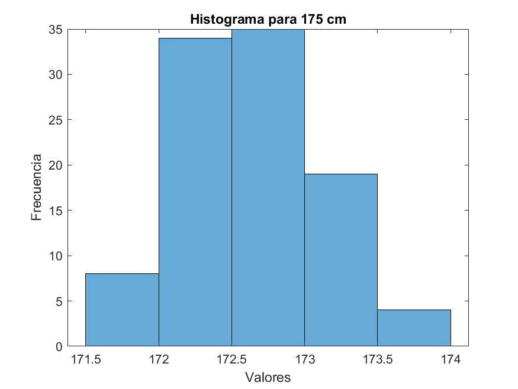

# Laboratorio 3 - Incertidumbre en sensores
# Fundamentos de Robótica Móvil
# Mayo 2024


# Integrantes:
- Johan López
- David Cocoma
- Joan Sebastián Jauregui
- Felipe Cruz

# Contenido
En el repositorio de este laboratorio se encuentra lo siguiente:
- README.md -> Archivo base con la descripción del laboratorio.
- Imgs -> Carpeta con imágenes utilizadas en el archivo README.
- Code -> Carpeta con los diferentes códigos utilizados durante la práctica: Matlab (*.m*), Arduino (*.ino*), y LegoMindstorms (*.lmsp*).
- Datos -> Carpeta con los archivos .csv que contienen los datos tomados y códigos en Python para el procesamiento de estos.

Tabla de Contenidos
---

- [Cuestionario](#cuestionario)
- [Sensor Lidar](#sensor-lidar)
   - [Preparación Lidar](#preparación-del-entorno-y-del-sensor-lidar)
   - [Toma de datos Lidar](#toma-de-datos-lidar)
   - [Procesamiento de datos Lidar](#procesamiento-de-datos-lidar)
      - [Ploteo](#ploteo)
      - [Mapa de ocupación](#mapa-de-ocupación)
      - [Mapa del entorno](#mapa-del-entorno)
   - [Análisis y fuentes de error](#análisis-y-fuentes-de-error)
- [Sensor Ultrasonido](#sensor-ultrasonido)
   - [Preparación Ultrasonido](#preparación-del-entorno-y-del-sensor-ultrasonido)
   - [Toma de datos ultrasonido](#toma-de-datos-ultrasonido)
   - [Procesamiento de datos ultrasonido](#procesamiento-de-datos-ultrasonido)
      - [Medidas estadísticas](#medidas-estadísticas)
      - [Gráficos estadísticos](#gráficos-estadísticos)
      - [Análisis y conclusiones](#análisis-y-conclusiones)
- [Sensores Lego](#sensores-lego)
   - [Preparación Robot Lego EV3](#preparación-del-entorno-y-del-robot-lego-ev3)
   - [Medición distancia](#medición-de-distancia-en-avance)
      - [Experimento de avance](#experimento-de-avance)
         - [Avance ultrasonido](#avance-con-ultrasonido)
         - [Avance encoder](#avance-con-encoder-del-motor)
      - [Experimento de avance a máxima velocidad](#experimento-de-avance-a-máxima-velocidad)
         - [Avance ultrasonido máxima velocidad](#avance-con-ultrasonido-máxima-velocidad)
         - [Avance encoder máxima velocidad](#avance-con-encoder-del-motor-máxima-velocidad)
      - [Análisis/Errores avance](#análisis-comparativo-y-cálculo-de-errores-avance)
   - [Medición ángulo de giro](#medición-del-ángulo-de-giro-de-las-ruedas)
      - [Setup experimental](#setup-experimental)
      - [Experimento 30 grados](#experimento-30-grados)
      - [Experimento 45 grados](#experimento-45-grados)
      - [Análisis/Errores giro](#análisis-comparativo-y-cálculo-de-errores-giro)

# Cuestionario
1. ¿Qué es el Vocabulario Internacional de Metrología (VIM)? 

 Es un diccionario terminolohgico que contiene las definiciones y denominaciones que conciernen a la metrologia,ciencia de las mediciones y sus aplicaciones, el cual pretende ser una guia comun para todo aquel implicado en la planificacion y realizacion de mediciones incluyendo asi a cualquier individuo u organizacion.Se tienen tres ediciones del VIM siendo asi le tercera edicion la vigente en la actualidad ,esta edicion tiene un enfoque en la incertidumbre de la medida , en esta edicion se pueden encontrar lo siguiente :magnitudes y unidades,mediciones,dispositivos de medida,propiedades de los dispositivos de medida y patrones ,asi como tambien las convenciones respectivas.

2. Según el VIM ¿Qué es?
- exactitud de medida: Es la proximidad entre un valor medido y un valor verdadero de un mensurando (2.13)
- precisión de medida: Es la proximidad entre las indicaciones o los valores medidos obtenidos en mediciones repetidas de un
mismo objeto, o de objetos similares, bajo condiciones especificadas (2.15)
- error de medida: Es la diferencia entre un valor medido de una magnitud y un valor de referencia (2.16)
- incertidumbre de medida: Es la parámetro no negativo que caracteriza la dispersión de los valores atribuidos a un mensurando, a
partir de la información que se utiliza (2.26)

NOTA: los numeros al final de cada definicion corresponde a la numeracion del VIM tercera edicion.

3. Explique la diferencia entre un error sistemático y un error aleatorio.

  Ambos son compnentes de error de medida en los que en mediciones repetidas para el sistematico  es constante o predecible y para el aleatorio varia de forma impredecible.(2.17 y 2.19)

4. De acuerdo a la teoría de estadística: ¿Qué es valor medio? ¿Cuáles magnitudes se usan para medir la dispersión de datos?

  Es el valor tipico o promedio que representa la tendencia general de los datos ,tambien conocido como medida de tendencia central, se tienen tres medidas de tendencia central las cuales son :moda,media y madiana.
  Para medir la dispersion de datos se tienen las siguientes medidas de variabilidad:Rango ,Varianza ,Desviacion estandar y el Rango interquartilico.

# Sensor Lidar

https://la.mathworks.com/matlabcentral/fileexchange/57425-matlab-driver-for-hokuyu-urg-family
https://la.mathworks.com/matlabcentral/fileexchange/36700-hokuyo-urg-04lx-lidar-driver-for-matlab

```
Warning: serial will be removed in a future release. Use serialport
instead. 
Warning: Unsuccessful read: A timeout occurred before the Terminator
was reached.
'serial' unable to read all requested data. For more information on
possible reasons, see Serial Read Warnings. 
Warning: Unsuccessful read: A timeout occurred before the Terminator
was reached.
'serial' unable to read all requested data. For more information on
possible reasons, see Serial Read Warnings. 

ans =

    'VV
     00P
     VEND:Hokuyo Automatic Co.,Ltd.;[
     PROD:SOKUIKI Sensor URG-04LX-UG01(Simple-URG);[
     FIRM:3.4.03(17/Dec./2012);T
     PROT:SCIP 2.0;N
     SERI:H1510998;V
     
     '

Warning: Unsuccessful read: A timeout occurred before the Terminator
was reached.
'serial' unable to read all requested data. For more information on
possible reasons, see Serial Read Warnings. 

ans =

    'BM
     02R
     
     '
```
## Preparación del entorno y del sensor Lidar

Este código en MATLAB configura la comunicación serie con un sensor LIDAR utilizando el protocolo SCIP2.0. A continuación se explica cada parte del código y su función:

#### Configuración de la Comunicación Serie

```matlab
lidar = serial('COM11', 'baudrate', 115200);
```
- **`serial`**: Crea un objeto de comunicación serie llamado `lidar` en el puerto `COM11` con una velocidad de transmisión de 115200 baudios.

#### Configuración del Objeto Serie

```matlab
set(lidar, 'Timeout', 0.5);
set(lidar, 'InputBufferSize', 40000);
set(lidar, 'Terminator', 'CR');
```
- **`Timeout`**: Establece el tiempo de espera para la comunicación serie en 0.5 segundos.
- **`InputBufferSize`**: Configura el tamaño del búfer de entrada en 40000 bytes.
- **`Terminator`**: Establece el terminador de línea en 'CR' (retorno de carro), que indica el final de un comando o mensaje.

#### Abrir la Comunicación Serie

```matlab
fopen(lidar);
pause(0.1);
```
- **`fopen`**: Abre la comunicación serie con el sensor LIDAR.
- **`pause(0.1)`**: Pausa la ejecución del código durante 0.1 segundos para asegurar que la conexión se establezca correctamente.

#### Configuración del Protocolo y Verificación de la Versión

```matlab
fprintf(lidar, 'SCIP2.0');
pause(0.1);
fscanf(lidar);
```
- **`fprintf(lidar, 'SCIP2.0')`**: Envía el comando 'SCIP2.0' al LIDAR para configurar el protocolo de comunicación en SCIP2.0.
- **`pause(0.1)`**: Pausa durante 0.1 segundos para permitir que el LIDAR procese el comando.
- **`fscanf(lidar)`**: Lee la respuesta del LIDAR, verificando que el protocolo se haya configurado correctamente.

#### Comprobar Información de Versión

```matlab
fprintf(lidar, 'VV');
pause(0.1);
fscanf(lidar)
```
- **`fprintf(lidar, 'VV')`**: Envía el comando 'VV' para solicitar la información de la versión del LIDAR.
- **`pause(0.1)`**: Pausa durante 0.1 segundos para permitir que el LIDAR procese el comando y prepare la respuesta.
- **`fscanf(lidar)`**: Lee y muestra la información de la versión del LIDAR.

#### Encender el Láser

```matlab
fprintf(lidar, 'BM');
pause(0.1);
fscanf(lidar)
```
- **`fprintf(lidar, 'BM')`**: Envía el comando 'BM' para encender el láser del LIDAR.
- **`pause(0.1)`**: Pausa durante 0.1 segundos para permitir que el LIDAR procese el comando.
- **`fscanf(lidar)`**: Lee la respuesta del LIDAR, confirmando que el láser se ha encendido correctamente.

### Función Final del Código

El propósito final de este código es configurar la comunicación serie con un sensor LIDAR, cambiar el protocolo de comunicación a SCIP2.0, verificar la información de la versión del LIDAR y encender el láser. Esta configuración es esencial para preparar el LIDAR para operaciones de escaneo y medición de distancias, asegurando que el dispositivo esté listo para capturar datos precisos.

### Código relevante Lidar

Este código MATLAB realiza un escaneo LIDAR para obtener un vector de rango de 682 elementos, que representa las distancias medidas desde -120 a +120 grados. A continuación, se explica cada sección del código y su función:

#### Función `LidarScan`
```matlab
function [rangescan] = LidarScan(lidar)
```
Define una función llamada `LidarScan` que toma como entrada un objeto `lidar` y devuelve un vector `rangescan` con los resultados del escaneo.

#### Bucle de Escaneo LIDAR
```matlab
proceed = 0;
while (proceed == 0)
    fprintf(lidar, 'GD0044072500');
    pause(0.01);
    data = fscanf(lidar);
    if numel(data) == 2134
        proceed = 1;
    end
end
```
- **Inicialización**: `proceed` se inicializa en 0.
- **Bucle `while`**: Se ejecuta hasta que `proceed` sea 1.
  - **Enviar Comando**: `fprintf(lidar, 'GD0044072500');` envía un comando al dispositivo LIDAR para iniciar un escaneo.
  - **Pausa**: `pause(0.01);` espera 0.01 segundos.
  - **Leer Datos**: `data = fscanf(lidar);` lee los datos recibidos del LIDAR.
  - **Validación de Datos**: Si el número de elementos en `data` es 2134, el bucle se detiene (`proceed = 1`).

#### Procesamiento de Datos
```matlab
i = find(data == data(13));
rangedata = data(i(3) + 1:end - 1);
for j = 0:31
    onlyrangedata((64 * j) + 1:(64 * j) + 64) = rangedata(1 + (66 * j):64 + (66 * j));
end
```
- **Buscar Índices**: `i = find(data == data(13));` encuentra los índices donde el valor es igual al valor en la posición 13 de `data`.
- **Extraer Datos de Rango**: `rangedata = data(i(3) + 1:end - 1);` extrae los datos relevantes para el rango.
- **Organizar Datos**: El bucle `for` organiza `rangedata` en segmentos de 64 elementos dentro de `onlyrangedata`.

#### Decodificación de Distancias
```matlab
j = 0;
for i = 1:floor(numel(onlyrangedata) / 3)
    encodeddist(i, :) = [onlyrangedata((3 * j) + 1) onlyrangedata((3 * j) + 2) onlyrangedata((3 * j) + 3)];
    j = j + 1;
end
for k = 1:size(encodeddist, 1)
    rangescan(k) = decodeSCIP(encodeddist(k, :));
end
```
- **Preparar Datos Codificados**: Se organiza `onlyrangedata` en grupos de 3 elementos y se almacena en `encodeddist`.
- **Decodificación**: Se llama a la función `decodeSCIP` para cada conjunto de datos en `encodeddist` y se almacena el resultado en `rangescan`.

El código realiza un escaneo LIDAR para medir distancias dentro de un rango de -120 a +120 grados, decodificando los datos recibidos y organizándolos en un vector de rangos. La función `LidarScan` se comunica con el dispositivo LIDAR, valida los datos recibidos, organiza y decodifica la información para devolver las distancias medidas.

#### Función `decodeSCIP`
El código hace referencia a una función llamada `decodeSCIP`, que no se proporciona, pero se puede inferir que esta función decodifica los datos codificados del LIDAR en valores de distancia reales.

## Toma de datos Lidar

Toma 1


Toma 2


Toma 3


## Procesamiento de datos Lidar
Para realizar el procesamiento de datos obtenidos es necesario saber acerca del entorno e informacion general del lidar.
Informacion del lidar necesaria es la siguiente:distancia maxima medible es de 4000mm y el valor minimo es de 20mm,el lidar no da una vuelta completa sino 240 grados ,resolucion de 1mm y por ultimo el driver utilizado para el lidar permite obtener un total de 682 datos.

El espacio que se dispuso para el lidar tiene 29.5 cm en x y 23 cm para y ,en la siguiente imagen se puede observar la ubicacion del lidar en cada una de las tomas (P1,P2 y P3) junto a estas las coordenadas y el angulo con el cual el lidar empieza el escaneo.
Se puede observar la ubicacion de muros y obstaculos cercanos a cada toma del lidar ,asi como tambien sus dimensiones.

### Ploteo
En la siguiente imagen se tiene el plot para la primera toma del lidar,en la primera toma el angulo con el cual empezo el escaneo es de 0 y termina antes de completar el tercer cuadrante lo que coincide con los 240 grados ,ademas su recorrido es en contra de las manecillas del reloj .Acerca de la distribucion de puntos el primer cuadrante los tiene alejados como se esperaba ,la distribucion de puntos para el segundo cuadrante son cercanos mas de lo que se esperaba y por ultimo en el tercer cuadrante se tienen puntos alejados y cercano cuando se esperaba solo que fueran cercanos ya que habian muros en ese lugar.

El plot de la segunda toma se tiene que empieza en 90 grados lo cual con los 240 grados no deberian haber datos en el primer cuadrante ,para el segundo cuadrante los datos estan cerca y luego se alejan como se esperaba ,sin embargo los datos que estan cerca estan demasiado cerca .Para el tercer cuadrante se espera algo similar a el anterior cuadrante en el cual hay datos cercanos y luego se alejan rapidamente debido a que se termina el muro ,en el cuarto cuadrante en el cual se esperaba que los datos estuviesen alejados la distribucion obtenida es demasiado cercana de hecho los datos obtenidos son solo dos valores 0 y 20.


### Mapa de ocupación


### Mapa del entorno

## Análisis y fuentes de error

# Sensor Ultrasonido

## Preparación del entorno y del sensor ultrasonido

### Código ultrasonido

Este código de Arduino está diseñado para medir la distancia utilizando un sensor ultrasónico. Aquí te explico cada parte del código:

#### Declaración de Variables

```cpp
// declaración de variables para pines
const int pinecho = 11;
const int pintrigger = 12;
```
- `pinecho`: Define el pin 11 como el pin de entrada para el sensor ultrasónico.
- `pintrigger`: Define el pin 12 como el pin de salida para el sensor ultrasónico.

```cpp
// variables para calculos
unsigned long tiempo;
float distancia;
```
- `tiempo`: Variable para almacenar el tiempo que tarda el eco en regresar al sensor.
- `distancia`: Variable para almacenar la distancia calculada en centímetros.

#### Función `setup()`

```cpp
void setup()
{
  // preparar la comunicación serial
  Serial.begin(9600);
 
  // configurar los pines utilizados por el sensor
  pinMode(pinecho, INPUT);
  pinMode(pintrigger, OUTPUT);
}
```
- `Serial.begin(9600)`: Inicia la comunicación serial a una velocidad de 9600 baudios.
- `pinMode(pinecho, INPUT)`: Configura el pin `pinecho` (11) como entrada.
- `pinMode(pintrigger, OUTPUT)`: Configura el pin `pintrigger` (12) como salida.

#### Función `loop()`

```cpp
void loop()
{
  // asegurarnos que el pin trigger se encuentra en estado bajo
  digitalWrite(pintrigger, LOW);
  delayMicroseconds(2);
 
  // comenzamos pulso alto, debe durar 10 uS
  // luego regresamos a estado bajo
  digitalWrite(pintrigger, HIGH);
  delayMicroseconds(10);
  digitalWrite(pintrigger, LOW);
 
  // medimos el tiempo en estado alto del pin "echo"
  // el tiempo en estado alto es proporcional a la distancia medida
  tiempo = pulseIn(pinecho, HIGH);
 
  // LA VELOCIDAD DEL SONIDO ES DE 340 M/S O 29,4 MICROSEGUNDOS POR CENTIMETRO
  // DIVIDIMOS EL TIEMPO DEL PULSO ENTRE 58, TIEMPO QUE TARDA RECORRER IDA Y
  // VUELTA UN CENTIMETRO LA ONDA SONORA
  distancia = float(tiempo) / 58.8;
 
  // imprimir la distancia medida al monitor serial
  Serial.print(distancia);
  Serial.print('\n');
 
  // esperar 0,25 segundos antes de realizar otra medición
  delay(250);
}
```

1. **Generar el Pulso Ultrasónico**:
   ```cpp
   digitalWrite(pintrigger, LOW);
   delayMicroseconds(2);
   digitalWrite(pintrigger, HIGH);
   delayMicroseconds(10);
   digitalWrite(pintrigger, LOW);
   ```
   - Se asegura que el pin `pintrigger` está en estado bajo (LOW) durante 2 microsegundos.
   - Luego se envía un pulso alto (HIGH) de 10 microsegundos al pin `pintrigger` para generar una señal ultrasónica.
   - Finalmente, se vuelve a poner el pin `pintrigger` en estado bajo (LOW).

2. **Medir el Tiempo del Eco**:
   ```cpp
   tiempo = pulseIn(pinecho, HIGH);
   ```
   - `pulseIn(pinecho, HIGH)` mide el tiempo que el pin `pinecho` permanece en estado alto (HIGH), lo cual es proporcional a la distancia al objeto.

3. **Calcular la Distancia**:
   ```cpp
   distancia = float(tiempo) / 58.8;
   ```
   - La distancia se calcula dividiendo el tiempo medido entre 58.8, basado en la velocidad del sonido (340 m/s).

4. **Imprimir la Distancia**:
   ```cpp
   Serial.print(distancia);
   Serial.print('\n');
   ```
   - La distancia medida se envía al monitor serial para visualizarla.

5. **Esperar Antes de la Próxima Medición**:
   ```cpp
   delay(250);
   ```
   - Se espera 250 milisegundos (0.25 segundos) antes de realizar otra medición.

Este ciclo se repite indefinidamente mientras el Arduino esté encendido, midiendo y reportando la distancia detectada por el sensor ultrasónico.

## Toma de datos ultrasonido

1: 1m


2: 1.75m


3: 2.5m


## Procesamiento de datos ultrasonido

Este código de MATLAB se encarga de leer datos de un archivo CSV, convertirlos a un arreglo numérico y luego crear un histograma a partir de estos datos. El histograma se guarda como una imagen y se muestra información básica sobre el vector de datos. Aquí tienes una explicación detallada de cada parte del código:

#### Definición del Nombre del Archivo CSV
```matlab
sample1 = 'C:\Users\Joho_\Desktop\semestre\fundamentos de robotica movil\labs\lab3\Sample1.csv';
```
- Se define la ruta completa del archivo CSV que contiene los datos a procesar.

#### Lectura de Datos del Archivo CSV
```matlab
datos1 = readtable(sample1);
```
- Se lee el archivo CSV y se almacena su contenido en una tabla llamada `datos1`.

#### Suposiciones sobre las Columnas
```matlab
% Suponemos que las columnas son:
% Columna 1: Valores Reales
% Columna 2: Valores Predichos
% Columna 3: Distancia
```
- Se asume que las columnas del archivo CSV tienen los siguientes significados:
  - Columna 1: Valores Reales
  - Columna 2: Valores Predichos
  - Columna 3: Distancia

#### Conversión de la Tabla a un Arreglo Numérico
```matlab
datosNumericos1 = table2array(datos1);
valorReal1 = 100;
histogramaDeVector(datosNumericos1);
```
- `datosNumericos1` convierte la tabla `datos1` a un arreglo numérico.
- `valorReal1` se define como 100, aunque no se utiliza posteriormente en el código.
- `histogramaDeVector(datosNumericos1)` llama a la función `histogramaDeVector` pasando el arreglo `datosNumericos1`.

#### Definición de la Función `histogramaDeVector`
```matlab
function histogramaDeVector(vectorDatos)
    % Esta función crea un histograma a partir de un vector de datos.

    % Verificar si el vectorDatos está vacío
    if isempty(vectorDatos)
        disp('El vector está vacío. Proporciona un vector con datos.');
        return;
    end

    % Crear el histograma
    figure; % Abre una nueva figura
    histogram(vectorDatos); % Crea el histograma
    title('Histograma para 100 cm'); % Título del histograma
    xlabel('Valores'); % Etiqueta del eje X
    ylabel('Frecuencia'); % Etiqueta del eje Y

    % Guardar la figura como una imagen
    saveas(gcf, 'C:\Users\Joho_\Desktop\semestre\fundamentos de robotica movil\labs\lab3\histograma100cm.png');

    % Mostrar información básica
    disp(['Número de elementos: ', num2str(length(vectorDatos))]);
    disp(['Valor mínimo: ', num2str(min(vectorDatos))]);
    disp(['Valor máximo: ', num2str(max(vectorDatos))]);
end
```
#### Verificación del Vector de Datos
```matlab
    if isempty(vectorDatos)
        disp('El vector está vacío. Proporciona un vector con datos.');
        return;
    end
```
- Verifica si el vector `vectorDatos` está vacío y, de ser así, muestra un mensaje y termina la función.

#### Creación del Histograma
```matlab
    figure; % Abre una nueva figura
    histogram(vectorDatos); % Crea el histograma
    title('Histograma para 100 cm'); % Título del histograma
    xlabel('Valores'); % Etiqueta del eje X
    ylabel('Frecuencia'); % Etiqueta del eje Y
```
- Abre una nueva figura.
- Crea un histograma a partir de `vectorDatos`.
- Añade un título y etiquetas a los ejes X e Y.

#### Guardado de la Figura
```matlab
    saveas(gcf, 'C:\Users\Joho_\Desktop\semestre\fundamentos de robotica movil\labs\lab3\histograma100cm.png');
```
- Guarda la figura del histograma como una imagen PNG en la ruta especificada.

#### Mostrar Información Básica
```matlab
    disp(['Número de elementos: ', num2str(length(vectorDatos))]);
    disp(['Valor mínimo: ', num2str(min(vectorDatos))]);
    disp(['Valor máximo: ', num2str(max(vectorDatos))]);
```
- Muestra en la consola el número de elementos, el valor mínimo y el valor máximo del vector de datos.


### Medidas estadísticas

*1: 1m*
$$\bar{x} = 97.7693$$
$$S=0.4594$$
$$S^2=0.2110$$
$$error Absoluto = 3.08\%$$
$$error Relativo = 0.0308\%$$

*2: 1.75m*

$$\bar{x} = 172.6080$$
$$S=0.5434$$
$$S^2=0.2953$$
$$error Absoluto = 3.4700\%$$
$$error Relativo = 0.0198\%$$

*3: 2.5m*
$$\bar{x} = 237.8667$$
$$S=14.2758$$
$$S^2=203.7976$$
$$error Absoluto = 35.7800\%$$
$$error Relativo = 0.1431\%$$


### Gráficos estadísticos

1: 1m


2: 1.75m



3: 2.5m


### Análisis y conclusiones

Se encontro que a medida que se incrementa la distancia, el error absoluto aumenta hasta llegar a ser superior al 30% para 2.5 metros. Se considera apropiado no usar el sensor de ultrasonido para distancias mayores a un metro dado que su error absoluto es de 3%.
# Sensores Lego

30%
Ultrasonido: 101.6cm - Patron: 101.1cm
Encoder B: 2096 grad - Patron: 99.5cm
Encoder C: 2098 grad - Patron: 99.4cm

100%
Ultrasonido: 134.1cm - Patron: 133.5cm
Encoder B: 2134 grad - Patron: 98.4cm
Encoder C: 2133 grad - Patron: 98.3cm

## Preparación del entorno y del robot Lego EV3

### Código relevante EV3

## Medición de distancia en avance

### Experimento de avance

#### Avance con ultrasonido

#### Avance con encoder del motor

### Experimento de avance a máxima velocidad


#### Avance con ultrasonido máxima velocidad

Lego Velocidad 100% - Desplazamiento de 100 cm

[](https://www.youtube.com/watch?v=8byMhU9oRZg)

Lego Velocidad 30% - Desplazamiento de 100 cm

[](https://www.youtube.com/watch?v=9WclsTMnz-s)


#### Avance con encoder del motor máxima velocidad

### Análisis comparativo y cálculo de errores avance

## Medición del ángulo de giro de las ruedas

### Setup experimental

### Experimento 30 grados

### Experimento 45 grados

### Análisis comparativo y cálculo de errores giro
