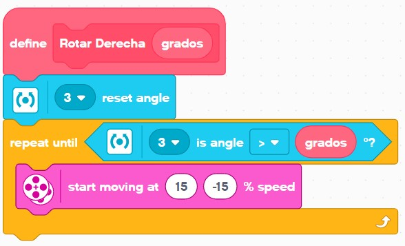

# Laboratorio 4 - Navegación basada en comportamientos
# Fundamentos de Robótica Móvil
# Mayo 2024

# Integrantes:
- Johan López
- David Cocoma
- Joan Sebastián Jauregui
- Felipe Cruz

# Contenido
En el repositorio de este laboratorio se encuentra lo siguiente:
- README.md -> Archivo base con la descripción del laboratorio.
- Imgs -> Carpeta con imágenes utilizadas en el archivo README.
- CodeEV3 -> Carpeta con los dos algoritmos utilizados en las misiones. Los archivos son para utilizar en el software Lego Mindstorms EV3.

Tabla de Contenidos
---

- [Introducción](#introducción)
- [Consulta bibliográfica previa](#consulta-bibliográfica-previa)
   - [Características navegación](#características-navegación)
   - [Investigaciones robotistas](#investigaciones-robotistas)
   - [Algoritmos planeación de rutas](#algoritmos-planeación-de-rutas)
   - [Algoritmos Bug](#algoritmos-bug)
   - [Maze algorithm](#maze-algorithm)
- [Misión 1](#misión-1)
   - [Preparación de misión 1](#preparación-de-misión-1)
   - [Algoritmo de solución 1](#algoritmo-de-solución-1)
   - [Video del resultado 1](#video-del-resultado-1)
- [Misión 2](#misión-2)
   - [Preparación de misión 2](#preparación-de-misión-2)
   - [Algoritmo de solución 2](#algoritmo-de-solución-2)
   - [Video del resultado 2](#video-del-resultado-2)
- [Conclusiones](#conclusiones)

# Introducción

# Consulta bibliográfica previa

## Características navegación
**Al menos dos características de la navegación planeada y de la navegación basada en comportamientos y su influencia en el tipo de respuesta del robot.**

### Navegación planeada
*Características:*

1. Uso de mapa conocido: Utiliza un mapa del entorno previamente conocido. Puede estar basado en modelos geométricos, topológicos o probabilísticos.

2. Ruta pre-calculada: La ruta se calcula antes de que el robot comience a moverse.

3. Optimización de eficiencia: Permite evitar obstáculos conocidos minimizando el tiempo de viaje o el consumo de energía.

4. Limitación en entornos dinámicos: Puede tener dificultades para adaptarse si el entorno cambia sin replanificar.

*Respuesta del robot:*

Este tipo de navegación hace que el robot realice recorridos óptimos y sin errores, siempre y cuando se haya logrado modelar su entorno de manera precisa. Cualquier cambio en el entorno del robot generará un mal comportamiento ya que el robot no se adapta a cambios en su entorno. El movimiento del robot está predefinido y éste lo hará sin importar lo que suceda a su alrededor, y sin revisar si se está realizando correctamente. Esta navegación es exitosa siempre que se logre tener un entorno de misión muy bien controlado.

### Navegación basada en comportamientos
*Características:*

1. Reactividad en tiempo real: Toma decisiones basadas en reglas simples y percepciones del entorno en tiempo real, que se detectan mediante los sensores del robot.

2. Adaptabilidad al entorno: Gran adaptabilidad a cambios en el entorno. Ideal para entornos desconocidos o dinámicos.

3. Comportamientos simples: Utiliza comportamientos simples como "evitar obstáculos" o "seguir una pared". Permite combinar comportamientos simples para crear comportamientos complejos.

*Respuesta del robot:*

Este tipo de navegación hace que el robot utilice sus sensores para tomar decisiones de movimiento en tiempo real. El robot tiene predefinidas ciertas reglas a ejecutar en situaciones específicas. Cuando haya un cambio en el entorno del robot, este detectará dicho cambio y actuará en base a ello según las reglas que tenga programadas. El movimiento del robot siempre está retroalimentado por sus sensores para saber si va bien, o si debe cambiar de movimiento. Esta navegación es muy útil, ya que permite al robot adaptarse hasta cierto punto a diferentes entornos más realistas y menos controlados. 

## Investigaciones robotistas
**Investigaciones destacadas y robots desarrollados por los robotistas Rodney Brooks y Mark Tilden.**

### Rodney Brooks
En el siguiente link se encuentra toda la información relevante del robotista Rodney Brooks: https://people.csail.mit.edu/brooks/index.html.

*Investigaciones destacadas:*

- Subsumption Architecture: Reaccionar al mundo mediante tareas específicas y simples.

- Robot Intelligence: Inteligencia artifical aplicada en la robótica para entornos con humanos, o simulando a los humanos.

- Artificial Life: Agentes robóticos como si fueran vida y robots humanoides.

- Robot Motion Planning: Planeación y control de movimiento y de tareas. Uso de visión de máquina.

*Robots desarrollados:*

- Genghis: Robot hexápodo *insect-like*.

- Allen: Primer robot basado en Subsumption Architecture. 

- MIT Mobile Robots: Brooks trabajó con estos robots y desarrolló algunos de ellos. 

Fila de atrás, izquierda a derecha: Allen, Herbert, Seymour y Toto. Fila delantera, de izquierda a derecha: Tito, Genghis, Squirt (muy pequeño) Tom y Jerry, y Labnav.

### Mark Tilden

*Investigaciones destacadas:*

- Biomimesis: Robots e inteligencias artificales inspirados en la biología.

- BEAM: Robots: Mezcla de Biología, Electrónica, Estética (aesthetic) y Mecánica para crear y diseñar robots.

*Robots desarrollados:*

- WowWee Robosapien: Robot humanoide de juguete.

- Robótica BEAM: Múltiples robots y tecnologías que utilizan circuitos analógicos simples (no microcontroladores).

## Algoritmos planeación de rutas
**Mencione al menos tres de los algoritmos de planeación de rutas para espacios con obstáculos.**

La mayoría de algoritmos de planeación de rutas se basan en la Teoría de Grafos (rama Matemática), en donde las posibles ubicaciones del robot serán los nodos y los caminos a recorrer los vértices. En los grafos se pueden colocar pesos a los vértices para modelar una situación real como los obstáculos. Los algoritmos suelen enfocarse a encontrar el camino más corto SIN OBSTÁCULOS, sin embargo, con pequeñas modificaciones se pueden adaptar para encontrar el camino más corto evitando obstáculos.

1. **Dijkstra**: Encuentra el camino más corto desde un nodo inicial a todos los demás nodos en un grafo ponderado. Es ideal para grafos con pesos no negativos.

2. **A***: Utiliza una heurística para mejorar la eficiencia de la búsqueda del camino más corto. Es una versión informada del algoritmo de Dijkstra, lo que lo hace más rápido en muchos casos.

3. **Bellman-Ford**: Calcula el camino más corto desde un nodo a todos los demás nodos en un grafo ponderado, y puede manejar pesos negativos. Es útil cuando existen ciclos con peso negativo en el grafo.

4. **Breadth-First Search (BFS)**: Encuentra el camino más corto en un grafo no ponderado. Es útil para grafos donde todas las aristas tienen el mismo peso.

5. **Depth-First Search (DFS)**: Explora tanto como sea posible a lo largo de cada rama antes de retroceder. No garantiza el camino más corto, pero es útil para explorar todos los posibles caminos.

6. **Algoritmo de Johnson**: Encuentra los caminos más cortos entre todos los pares de nodos en un grafo, combinando las técnicas de Dijkstra y Bellman-Ford.

## Algoritmos Bug
**Describa brevemente los algoritmos Bug 0, Bug 1 y Bug 2.**

Los algoritmos Bug se basan en las siguientes suposiciones:

1. El robot es un punto en un espacio 2D.

2. Los obstáculos son desconocidos.

3. Se define punto de partida y punto objetivo.

4. El robot puede detectar los obstáculos desde alguna distancia conocida.

5. El robot siempre conoce la ubicación del punto objetivo.

### Bug 0

El robot se mueve hacia el objetivo. Si encuentra un obstáculo, lo rodea hasta que pueda seguir moviéndose hacia el objetivo, y continúa moviéndose hacia el objetivo.

Tomado de https://ucsb.app.box.com/v/LecturesRobotics.

### Bug 1

El robot se mueve hacia el objetivo. Si encuentra un obstáculo, lo rodea hasta encontrar el punto con menor distancia al objetivo, va a dicho punto y continúa moviéndose hacia el objetivo.

Tomado de https://ucsb.app.box.com/v/LecturesRobotics.

### Bug 2

El robot traza una línea recta que le permita llegar al objetivo. El robot se mueve hacia el objetivo siguiendo la línea recta. Si encuentra un obstáculo, lo rodea hasta volver a encontrar un punto sobre la línea recta original (que estará más cerca al objetivo), y continuará moviéndose hacia el objetivo.

Tomado de https://ucsb.app.box.com/v/LecturesRobotics.

## Maze algorithm

**Describa al menos un algoritmo de solución de un laberinto (maze algorithm) aplicado en robótica móvil.**

A continuación se presentan los algoritmos de solución de laberinto más conocidos. La información se obtuvo de: https://en.wikipedia.org/wiki/Maze-solving_algorithm.

### Random Mouse Algorithm
El algoritmo del ratón aleatorio (Random Mouse Algorithm) consiste en moverse aleatoriamente en cada intersección hasta encontrar la salida del laberinto. Este método no garantiza encontrar la solución de manera eficiente, pero eventualmente llegará a la salida si se mueve indefinidamente.

### Hand On Wall Rule
La regla de la mano en la pared (Hand On Wall Rule), implica mantener siempre una mano en una pared del laberinto y seguirla. Esto asegura encontrar la salida en laberintos que tienen todas sus paredes conectadas a la frontera del laberinto.

### Pledge Algorithm
El algoritmo de Pledge se utiliza para resolver laberintos en los que la regla de la mano en la pared no funciona debido a la presencia de ciclos. El método implica seguir una dirección fija y contar los giros a la derecha y a la izquierda, manteniendo un balance que permita al explorador volver a la dirección original.

### Trémaux's Algorithm
El algoritmo de Trémaux es un método de retroceso que marca cada camino recorrido y evita volver por el mismo camino más de una vez. Si se llega a un callejón sin salida, se retrocede por el mismo camino marcado. Este método asegura encontrar la salida y permite encontrar la solución más corta si se implementa correctamente.

### Dead-end Filling
El algoritmo de llenado de callejones sin salida (Dead-end Filling) consiste en identificar y llenar todos los callejones sin salida en el laberinto, convirtiéndolos en muros. Esto simplifica el laberinto y permite encontrar el camino hacia la salida de manera más directa.

### Recursive Algorithm
El algoritmo recursivo utiliza una estrategia de retroceso (backtracking). Comienza en el punto de partida y explora cada dirección posible recursivamente hasta que encuentra la salida o llega a un punto sin salida, en cuyo caso retrocede y prueba otra dirección.

### Maze-routing Algorithm
El algoritmo de enrutamiento de laberintos (Maze-routing Algorithm) se utiliza comúnmente en el diseño de circuitos electrónicos. Se basa en métodos sistemáticos para encontrar caminos desde el origen hasta el destino, como la propagación de una onda de expansión o técnicas de búsqueda en anchura (BFS).

### Shortest Path Algorithm
El algoritmo de camino más corto (Shortest Path Algorithm) busca encontrar la ruta más eficiente desde el inicio hasta la salida del laberinto. Métodos como el algoritmo de Dijkstra o el algoritmo A* son populares en este tipo de búsqueda, minimizando la distancia total recorrida.

### Multi-agent Maze-solving
El algoritmo de resolución de laberintos con múltiples agentes (Multi-agent Maze-solving) utiliza varios agentes que exploran el laberinto simultáneamente. Los agentes pueden comunicarse entre sí o trabajar de manera independiente, colaborando para encontrar la solución de manera más rápida y eficiente que un solo agente.

# Misión 1

## Preparación de misión 1

Se inició preparando el EV3 para trabajar con 4 sensores, dos sensores ultrasónicos de proximidad, un giroscopio y un sensor de color.
Un sensor de proximidad está ubicado orientado hacia el frente del robot, el segundo apuntando hacia el lateral izquierdo, el giroscopio de manera horizontal para detectar el giro del robot frente al plano horizontal y el sensor de color apuntando al suelo lo más cerca posible como se muestra en la siguiente foto.

A continuación, se adecuó la pista para ejecutar la misión, se colocó una cinta aislante negra a lo largo de la pista y al final de ella una pieza impresa en 3D con PLA de color verde, se colocaron dos obstáculos sobre la cinta negra como se muestra en la siguiente foto para obstaculizar el trayecto y se posicionó el EV3 en el extremo sin pieza orientado hacia la cinta. 

## Algoritmo de solución 1

**Uso de sensores:**
- Para seguir la línea, se usa el sensor de color (negro) en el frente del robot.
- Para detectar si hay un obstáculo, se usa el sensor ultrasónico en el frente del robot.
- Para detectar si se llegó a la meta, se usa el sensor de color (verde) en el frente del robot.
- Para rodear el obstáculo, se usa el sensor ultrasónico en el lateral del robot.
- El giroscopio se usa en pasos intermedios para acomodar el robot hacia alguna dirección requerida.

Ahora, se va a detallar el código y funcionamiento del algoritmo implementado en el robot EV3. Se utilizó la herramienta de Lego Mindstorm para programar la rutina del EV3 mediante bluetooth.

Para entender el código de bloques, es importante saber cuáles son las ubicaciones de los sensores en el brick EV3:
- Posición 1: Sensor de ultrasonido lateral.
- Posición 2: Sensor de ultrasonido frontal.
- Posición 3: Giroscopio.
- Posición 4: Sensor de color.

Al inicio del programa se le indica al robot que busque la línea negra, avanzando hasta que el sensor detecte el color negro, para luego inicializar el giroscopio en 0° y que quede en espera. 

La rutina empieza al presionar el botón del centro, al hacerlo entra en un bucle que se detiene una vez el color verde es detectado.
Dentro de este bucle se llama la función "seguir línea" siempre y cuando el sensor de proximidad orientado hacia el frente no detecte un obstáculo a menos de 15 centímetros, una vez detecte un obstáculo llama la función "Esquivar obstáculo".

Así se garantiza que siga la línea negra siempre que no tenga obstáculos al frente y se detenga al llegar al indicador verde de meta.

La función se seguir línea opera mediante un condicional, si detecta la línea negra en el sensor se inicia un movimiento de avance hacia la derecha y cuando no es detectado se inicia un movimiento de avance hacia la izquierda, de esta forma se mantiene el rumbo sobre el extremo derecho de la cinta e impide que se pierda hacia la izquierda de la cinta.

La función de esquivar obstáculo inicia rotando el robot hacia la derecha 80 grados, luego entra en un ciclo que funciona siempre que no se detecte nuevamente la cinta en el suelo, dentro del ciclo, el robot va a estar midiendo constantemente el sensor de proximidad orientado hacia la parte lateral izquierda; si se detecta el obstáculo a menos de 10 centímetros, realiza un pequeño giro de 1 grado hacia la derecha alejándose del obstáculo; en caso contrario, avanza rotando hacia la izquierda, acercándose al obstáculo. Siempre se rodea por la derecha.

Una vez el robot vuelve a detectar la línea negra que lo guía hacia la meta, el robot realiza una rotación para volver a dirigirse hacia la meta y vuelve a ejecutar la función de 'hallar línea'. Una vez halla la línea, continúa con el seguimiento de la línea hasta encontrar otro obstáculo o llegar a la meta.

Se crea una función para rotar el robot determinados grados hacia la derecha utilizando el giroscopio. Para esto, se resetea el giroscopio y se giran ambas ruedas en sentido contrario hasta que la rotación detectada por el giroscopio sea mayor al valor de giro deseado.

Los valores utilizados para la rotación del robot fueron calibrados a prueba y error. Esto, debido a la incertidumbre que se tiene en el giroscopio y a que el avance de seguimiento de línea del robot no es en línea recta sino en zig zag.

Adicionalmente, cuando el robot está realizando la rutina, la luz que se ilumina sobre el brick EV3 es de color rojo; y, cuando se llega a la meta, la luz que se ilumina es de color verde.

## Video del resultado 1

https://youtu.be/0FfZEKdz3vc

# Misión 2

## Preparación de misión 2

Para esta misión, se decidió utilizar los mismos sensores que para la misión 1, y configurados de la misma manera. 
Tal como se ilustró en [Preparación de misión 1](#preparación-de-misión-1).

A continuación, se adecuó la pista para ejecutar la misión, se construyó un laberinto con muebles y repisas de madera, de tal manera que el robot cupiera dentro de los pasillos y pudiera rotar sin problema. Para el inicio, se colocó un papel blanco sobre uno de los muebles, y para indicar el final (la meta), se colocó un papel blanco en el piso que puede ser detectado por el sensor de color.

Se pedía un laberinto que debe tener como mínimo 6L x 2L, donde L debe ser entre 1,5 y 2,0 veces el largo del EV3. El EV3 tiene una longitud aproximada de 15 cm, por lo tanto $L=2*15=30cm$. Por lo tanto, el laberinto debe tener como mínimo un tamaño de $6L\times 2L=180cm\times 60cm$. El laberinto utilzado en la misión (mostrado en la figura), tiene un tamaño aproximado de $200cm\times 120cm$, cumpliendo así con el requerimiento.

## Algoritmo de solución 2

**Uso de sensores:**
- Para girar hacia la izquierda y derecha, se usa el giroscopio para controlar cuántos grados girar.
- Para detectar si hay una pared al frente, se usa el sensor ultrasónico en el frente del robot.
- Para seguir la pared izquierda, se usa el sensor ultrasónico en el lateral del robot.
- Para detectar la meta, se usa el sensor de color (blanco).

Ahora, se va a detallar el código y funcionamiento del algoritmo implementado en el robot EV3. Se utilizó la herramienta de Lego Mindstorm para programar la rutina del EV3 mediante bluetooth.

Para entender el código de bloques, es importante saber cuáles son las ubicaciones de los sensores en el brick EV3:
- Posición 1: Sensor de ultrasonido lateral.
- Posición 2: Sensor de ultrasonido frontal.
- Posición 3: Giroscopio.
- Posición 4: Sensor de color.

Al inicio, el programa configura los motores, velocidades y resetea el giroscopio. Y queda en espera para iniciar la rutina.

Cuando se presiona el botón del centro, inicia la rutina. El robot va a 'seguir la pared' y revisar si encontró la meta, hasta que el sensor ultrasónico frontal detecte algo a menos de 15 cm. Al detectar algo en frente, revisa con el sensor ultrasónico lateral si hay algo a menos de 20 cm; en caso que sí, hay pared en la izquierda y por tanto se gira hacia la derecha; en caso que no, hay espacio en la izquierda y por tanto se gira hacia la izquierda. Cuando el robot detecta la meta, avanza recto por un tiempo para salir y se termina el programa.

Para seguir la pared, el roboot utiliza su sensor ultrasónico lateral (que está a la izquierda). El robot va a avanzar casi recto, pero una de las ruedas irá más rápido que la otra para que gire levemente. Si el sensor detecta la pared a menos de 10 cm, avanza girando levemente hacia la derecha (alejándose de la pared), y en caso contrario, avanza girando levemente hacia la izquierda (acercándose a la pared).

Se crea una función para rotar el robot determinados grados hacia la derecha utilizando el giroscopio. Para esto, se resetea el giroscopio y se giran ambas ruedas en sentido contrario hasta que la rotación detectada por el giroscopio sea mayor al valor de giro deseado. Y, se crea una función siilar para rotar el robot determinados grados hacia la izquierda. Como el giroscopio mide grados negativos cuando se gira hacia la izquierda, se debe aplicar otra lógica con negativos para obtener el resultado esperado, tal como se observa a continuación:

Los valores utilizados para la rotación del robot fueron calibrados a prueba y error. Esto, debido a la incertidumbre que se tiene en el giroscopio y a que el avance no es en línea recta.

Adicionalmente, cuando el robot está siguiendo la pared, ilumina de color rojo; cuando el robot está rotando hacia la derecha, ilumina de color verde; cuando el robot está rotando hacia la izqueirda, ilumina de color naranja; y, cuando el robot encuentra la meta, ilumina de color verde nuevamente.

## Video del resultado 2

# Conclusiones
